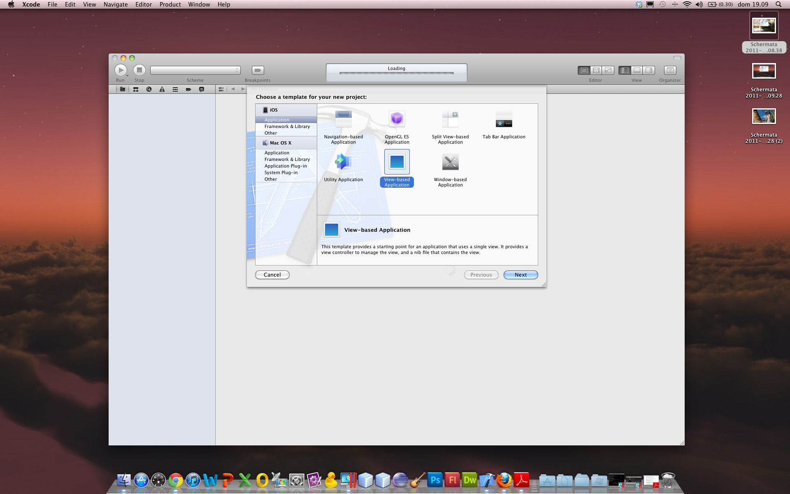
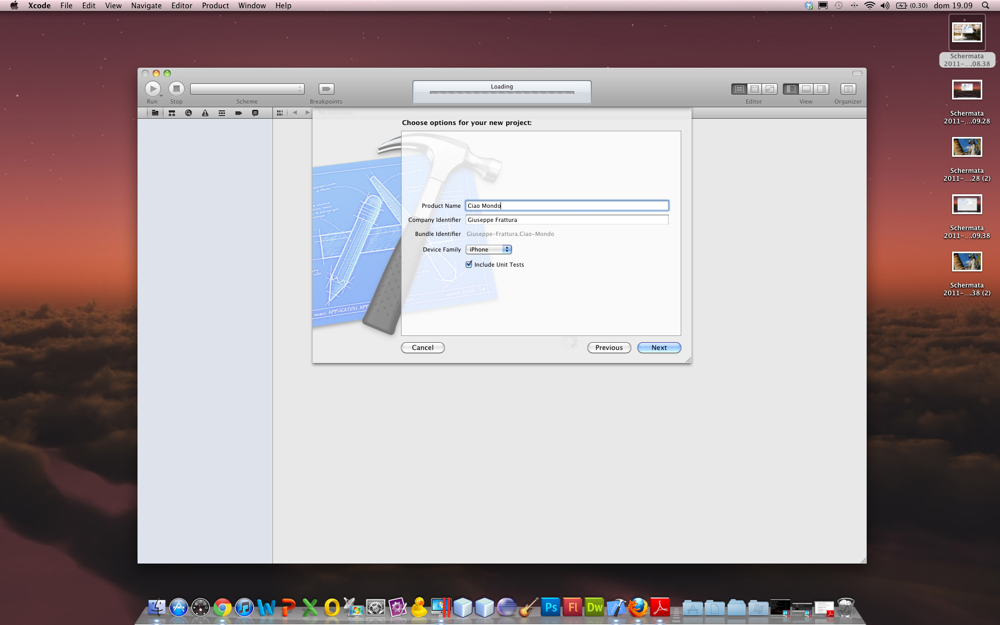
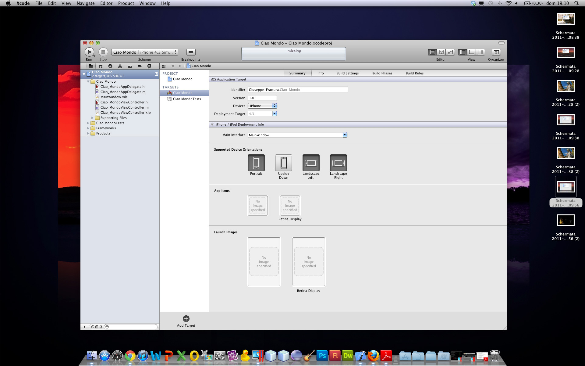
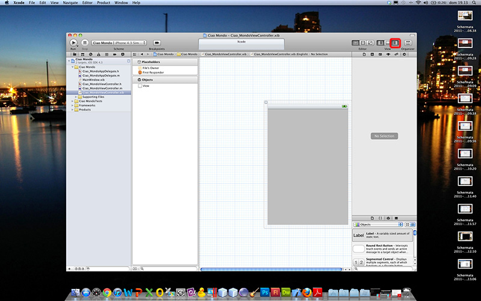
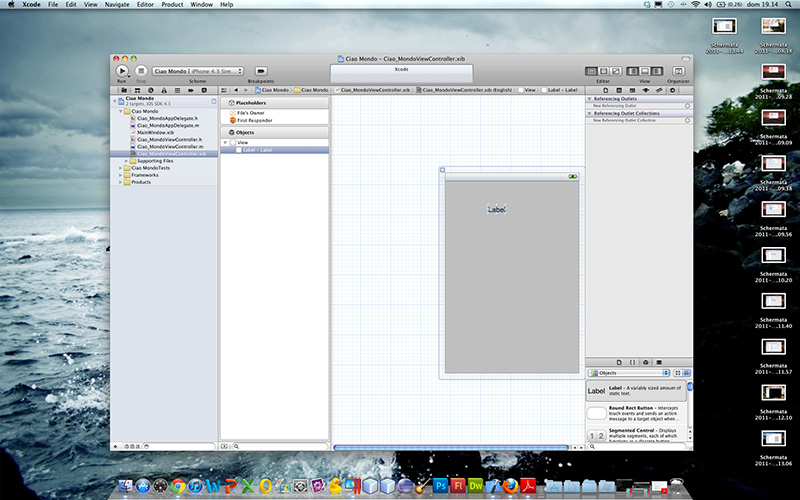
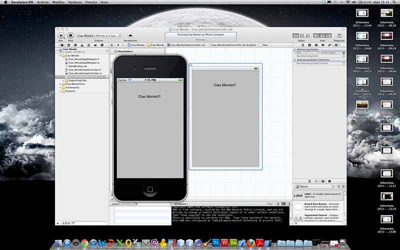

Per creare applicazioni iPhone serve sicuramente avere un MAC, con sistema operativo snow leopard, preferibilmente aggiornato all'ultima versione. Vediamo come creare in modo semplice e senza toccare una riga di codice la nostra prima applicazione "Hello World", in questo tutorial ho usato Xcode 4, ciò non toglie che è possibile effettuare le stesse cose anche con una versione precedente della IDE Apple.

### Per prima cosa lanciamo Xcode:

Andiamo su "Crea un nuovo progetto Xcode", da lì ci apparirà la schermata:

Per selezionare il tipo di applicazione da creare, lasciamo la scelta di Default: "View based Application" ed andiamo avanti dove ci verrà richiesto il nome dell'applicazione, l'identificativo della compagnia o comunque dell'autore e la famiglia di dispositivi per la quale l'applicazione sarà costruita.

Andiamo avanti ancora ed avremo finito il settaggio iniziale dell'applicazione e potremo iniziare a lavorare con Xcode. Ecco la schermata iniziale di XCode:

C'è la possibilità di cambiare nome ed i settaggi immessi prima, si possono impostare le icone e l'immagine iniziale sia per dispositivi muniti e non di Retina Display, è possibile inoltre scegliere l'SDK da utilizzare. Nella barra a sinistra noteremo tra i vari file un file "CiaoMondoViewController.xib", cliccandoci una volta sopra vedremo l'interfaccia grafica dell'iPhone:

Ora se clicchiamo sul bottone evidenziato in rosso (in alto a destra) si aprirà la barra laterale destra che nella parte bassa contiene tutti gli elementi che possiamo inserire nell'applicazione. Selezioniamo "Label" ed trasciniamolo sul disegno a forma di iPhone:

Clicchiamo due volte sull'oggetto appena trascinato così da poterci scrivere all'interno "Hello World" o qualsiasi saluto vogliate. Ora salvate, cliccate sul tasto RUN in alto a sinistra (a forma di play) e dovrebbe apparire il simulatore di iPhone a salutarvi!!!

