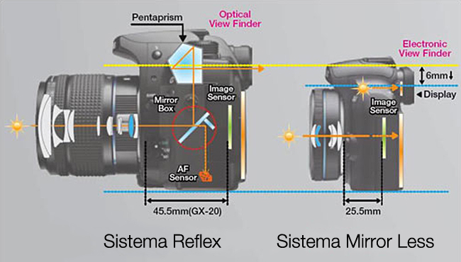
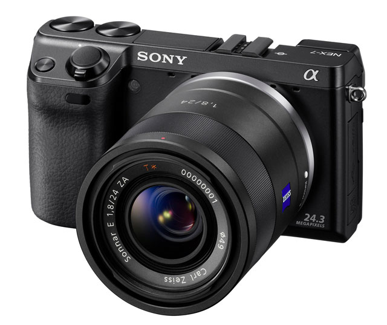

Ha avuto grande successo il mio articolo sulla scelta della fotocamera, così ho deciso di scriverne un altro su un particolare tipo di fotocamere che sta avendo un particolare successo anche se nato da poco: le fotocamere **mirrorless** dette anche **EVIL**.

<!--more-->

In questo settore sono entrati davvero tutti i più grandi produttori di fotocamere digitali, portando una grande evoluzione di questo settore.

Ma partiamo dall'inizio...

### Cos'è una fotocamera mirrorless?

La fotocamera mirrorless sfrutta la luce nello stesso modo di una reflex con la semplice differenza che non ha bisogno di uno specchio riflettente per trasmettere la luce sia nel mirino che sul sensore, perché grazie ai nuovi sensori che supportano il "Live View" ed hanno la possibilità di registrare video la luce viene diretta dall'ottica solo verso il sensore, poi c'è un mirino elettrico che mostrerà al fotografo ciò che sta inquadrando. Questo ha logicamente delle mancanze, esistono delle caratteristiche che i sensori non riescono a catturare come può fare un occhio umano, uno di questi è il cielo stellato, che per essere correttamente visto da una fotocamera digitale ha comunque bisogno di un esposizione prolungata.

La differenza nel funzionamento di una Reflex

I difetti in realtà non finiscono qua, un altro problema è la dimensione del sensore. I sensori installati nella maggior parte delle EVIL sono più piccoli dell'APS-C, ed hanno un fattore d'ingrandimento molto maggiore, si va dalle 5 alle 2 volte. Fatta eccezione per la Sony che ha creato la nex-5 e la nex-7 e la Pentax K-01 con sensore APS-C. Il problema di un sensore troppo piccolo è nell'alto rumore e nella poca profondità ottenibile. La nex-7 arriva a superare il migliaio di euro ma è comunque una fotocamera con sensore APS-C da 24 Megapixel, un buon parco ottiche (anche se alcune sono enormi rispetto al corpo macchina), e regge benissimo gli alti ISO.

La Sony Next-7 

I vantaggi di una mirrorless sono la compattezza, è quindi possibile portarne sempre una con sé, a patto di avere un'ottica abbastanza piccola.