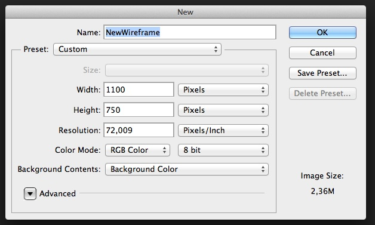
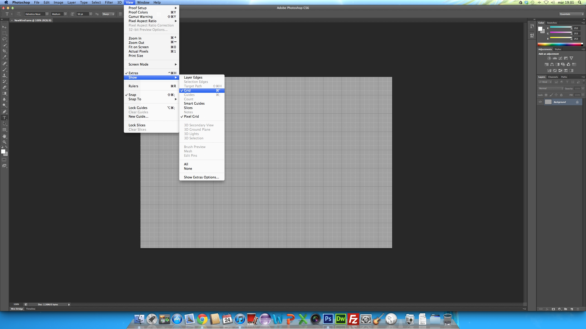
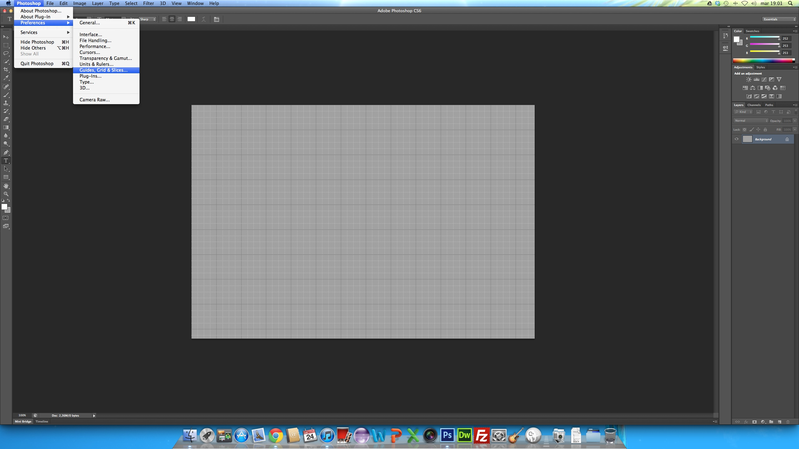
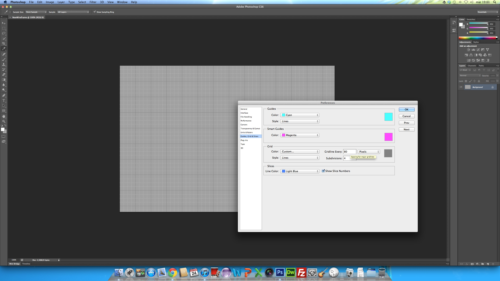
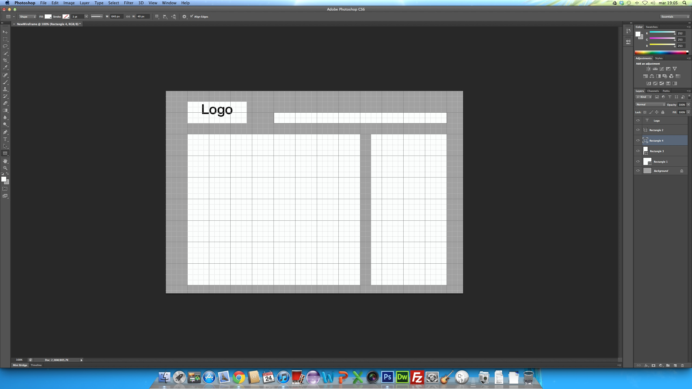
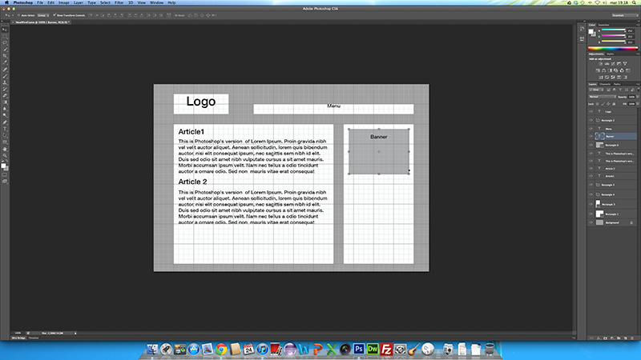

Photoshop è un potente software di grafica che non ha bisogno di presentazioni, volevo scrivere una piccola guida su come creare i wireframes di un sito internet con la sua ultima versione CS6.

I wireframes sono ottimi per presentare un sito ad un committente senza iniziare a scrivere codice ma giusto per capire come lavorare.

Per prima cosa creiamo in Photoshop un nuovo file 1100 x 750 px.

Fatto questo dividiamo l'immagine in griglie in modo da poter razionalizzare lo spazio ed esaminare nel dettaglio gli spazi dei singoli elementi della pagina.

Dopo aver impostato a nostro piacimento le caratteristiche delle griglie aggiungiamo dei rettangoli (Tasto rapido **U**) e creiamoli di colore differente dallo sfondo: nell'esempio ho utilizzato uno sfondo grigio, ed il colore dei rettangoli è bianco. In particolare ho usato il classico stile a due colonne.

Photoshop permette anche di inserire del testo all'interno dei rettangoli per specificarne i contenuti, ad esempio "Logo", ma è molto carina anche la funzione che selezionando lo strumento testo permette di riempire una casella con il Lorem Ipsum, **Type** -> **Paste Lorem Ipsum.**

Per approfondimenti visita:

- [How to setup a layout grid in Photoshop](http://www.sitepoint.com/how-to-setup-a-layout-grid-in-photoshop/)
- [Make wireframes with Photoshop CS6](http://www.netmagazine.com/tutorials/make-wireframes-photoshop-cs6)

Tu usi qualche altro strumento per creare i wireframes? Commenta e fammi sapere che ne pensi.
