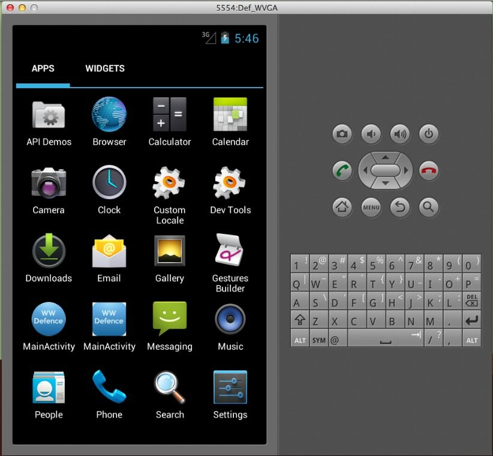

Per un progetto universitario mi tocca sviluppare un app Android, con un modello di sviluppo **Test Driven Development**. Prossimamente ne parlerò in un articolo, per oggi parlare delle applicazioni sviluppate in Landscape, ovvero pensate per essere utilizzate sfruttando la lunghezza del dispositivo e non la sua larghezza, le applicazioni di questo tipo sono di solito i giochi, in particolare quelli con motore grafico 3D. Vediamo ora come impostare l'emulatore android in landscape.

<!--more-->

Quando si lancia tramite Eclipse l'emulatore Android è sempre in modalità orizzontale

*L'emulatore Android nella sua posizione standard, verticale*

Premendo la combinazione di tasti Control + F11 (con l'aggiunta di Fn se si usa un Mac), ed ecco il risultato

*L'emulatore una volta impostato in modalità landscape*
