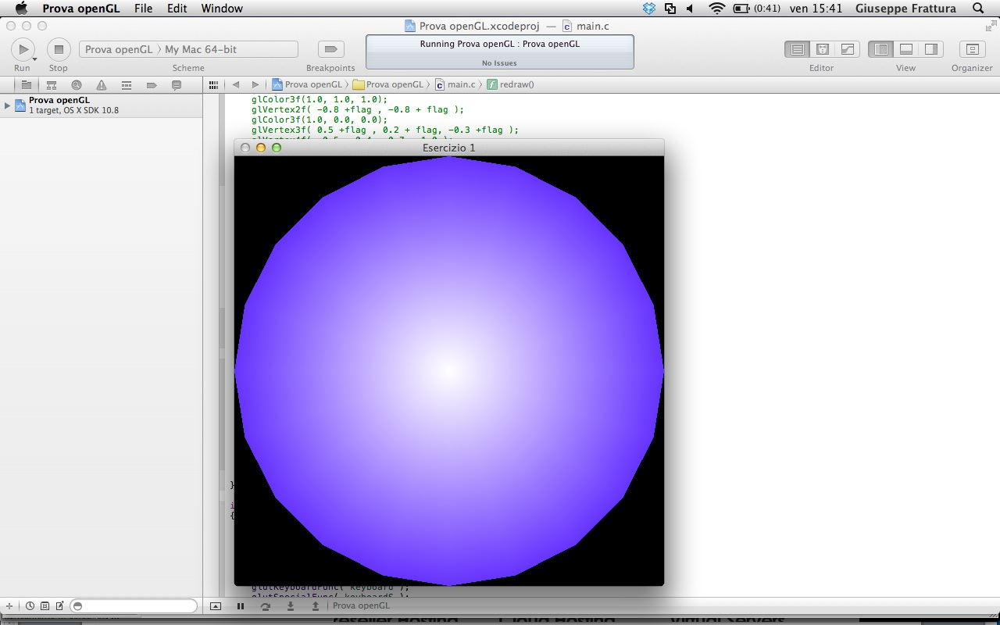

In questo articolo vorrei spiegare uno degli ultimi esercizi su OpenGL che ho fatto, l'esercizio tratta della creazione di un cerchio partendo però da forme geometriche elementari quali i triangoli.

<!--more-->

Per prima cosa includiamo le librerie, nota bene queste librerie esistono per Mac, per Linux e per Windows.

```c
#include <stdio.h>
#include "GLUT/glut.h"
#include "OPENGL/opengl.h"
#include <math.h>
#include <stdlib.h>
```

La funzione redraw è quella che viene lanciata dal main. Al suo interno creo un poligono chiamato triangle fan, questo deve avere tre o più vertici, il primo vertice sarà commune a tutti i triangoli creati.

```c
void redraw(void){
  float inc =(2 * M_PI)/ 20.0;
  glPointSize(1.0);
  glClear(GL_COLOR_BUFFER_BIT);
  glBegin(GL_TRIANGLE_FAN);
  glColor3f(1.0, 1.0, 1.0);
  glVertex2f(0, 0);
  for (float i=0; i < 2*M_PI+inc ; i=i+inc) {
    glColor3f(0.4, 0.2, 1.0);
    glVertex2f(sinf(i), cosf(i));
  }
  glEnd();
  glFlush();
}
```

All'interno del ciclo for inserisco tanti vertici quanti me ne servono per descrivere una circonferenza con la precision desiderata, per aumentare la precisione è necessario diminuire il valore della variabile inc dividendola ulteriormente.

```c
int main(int argc, const char * argv[])
{
  glutInit(&argc, argv);
  glutInitDisplayMode(GLUT_RGB);
  glutInitWindowPosition(300, 300);
  glutInitWindowSize(550, 550);
  glutCreateWindow("Esercizio Cerchio");
  glClearColor(0.0, 0.0, 0.0, 1.0);
  glutDisplayFunc(redraw);
  glutMainLoop();
}
```

Nel Main creo la finestra, dichiaro il suo nome le sue dimensioni, dove deve essere posizionata ed il colore dello sfondo, poi richiamo la funzione redraw.

Ecco il risultato:


