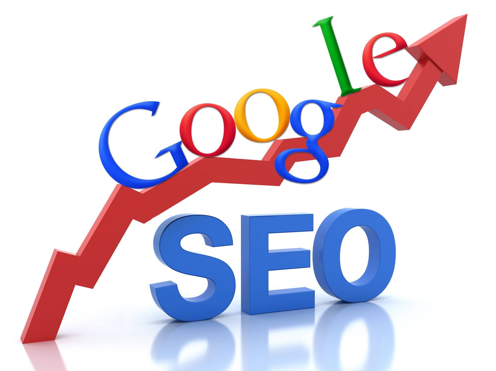

Seguendo il bravissimo e sempre aggiornato [Roberto Iacono](http://www.robertoiacono.it/) via Facebook mi sono imbattuto in questo articolo molto interessante 100 lezioni imparate durante 10 anni di SEO. La persona che lo scrive, Sujan Patel, ha lavorato per dieci anni nel settore SEO, quindi il lato di ottimizzazione dei siti web per una migliore indicizzazione su google. Questo è uno dei campi in cui ho molto bisogno di imparare e non vedo perché non farlo insieme ai miei lettori.

<!--more-->

1. Non creare link di riferimento al tuo sito troppo velocemente – è capitato che una volta costruito un sito creasse molti link in entrata per i primi giorni, ma poi non se ne occupava più, questo portava ad un incremento del rank del sito momentaneo, che poi però decresceva velocemente. Il consiglio è quindi di sostenere un approccio più continuativo che intenso;

2. Le Meta Description sono importanti – anche se per il momento non risultano avere un valore SEO, sono utili per il CTR (Click Through Rate);

3. Non essere ossessionato dal traffico e dal rank – i miglioramenti SEO si vedono nell'arco di mesi e non di giorni o settimane;

4. C'è una linea sottile tra l'essere analitici e l'essere ossessivi. Per guardare troppo i risultati di ranking si rischia di perdere tempo che si potrebbe impiegare in altri post per il blog o per altri links;

5. Non c'è un rimpiazzo per un buon prodotto – la miglior tecnica SEO è un buon prodotto, e non cambierà mai;

6. C'è una grande differenza tra ottimizzare un e-commerce, piccoli siti, ed altri. Bisogna capire non solo l'attuale situazione del sito, ma anche che tipo di sito sia. E la vostra strategia dovrebbe variare in base al tipo di sito;

7. Le tecniche vanno e vengono ma la creatività non muore mai - Odio vedere le persone seguire i consigli degli esperti alla cieca, senza conoscere se quella tecnica va bene per il suo tipo di sito;

8. L'età è solo un numero – L'età di un dominio e del sito concorrono ad aumentare il ranking. Ma non c'è motivo per abbattersi, ci sono anche altri fattori importanti nel ranking che danno opportunità di battere i tuoi concorrenti;

9. I grandi brand non sono difficile da battere – In generale più grande è il brand maggiore è il suo capitale ma è anche maggiore la lentezza nel muoversi;

10. Diversifica quello che fai – Google svaluta insiemi di link costruiti in modo simile.

Se ti interessano questi temi continua a leggere le altre 90 lezioni su [http://www.quicksprout.com/2012/07/16/100-lessons-learned-from-10-years-of-seo/](http://www.quicksprout.com/2012/07/16/100-lessons-learned-from-10-years-of-seo/)

Tra gli acquisti che consiglio su Amazon è presente anche la guida "SEO power. Strategie e strumenti per essere visibili sui motori di ricerca" Scritta da Giorgio Taverniti, ve ne consiglio vivamente la lettura!

Hai mai lavorato con il SEO, hai altri consigli da aggiungere a quanto detto in questo articolo?
