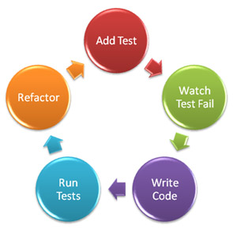

Il TestDriveDevelopment è una metodologia di sviluppo tipicamente utilizzata con modelli di sviluppo Agili. I modelli di sviluppo agili più conosciuti sono lo SCRUM e l'Extreme Programming. Nonostante sia spesso utilizzato in questi ambiti è possibile fare TDD qualunque sia il modello di sviluppo si preferisca usare.

<!--more-->

### In cosa consiste

Per prima cosa bisogna dire che non è semplice partire da zero con il TDD, il concetto di base è partire da una funzionalità che il nostro software deve avere, a questo punto creiamo un test.....
Si, può sembrare una cosa strana ma creiamo un test sul corretto funzionamento della funzionalità che dobbiamo ancora andare a implementare. Una volta fatto il test lo eseguiamo e come è logico pensare il test fallirà. Ora possiamo iniziare a scrivere la nostra nuova funzionalità, finita la quale il test dovrà dare esito positivo. Come passo finale si effettua la ristrutturazione del codice, ovvero si integra questa nuova funzionalità all'interno del codice precedentemente scritto in modo da mantenerlo leggibile e manutenibile evitando le così dette Bad Smell.

### I vantaggi del TDD

Il codice scritto in TDD è sicuramente più chiaro e facile da comprendere di codice scritto con altre modalità, i test possono descrivere appieno le funzionalità del programma. Inoltre è possibile verificare se quando si fa una modifica al codice il programma non funziona più correttamente, semplicemente rieseguendo la batteria di test.

### I difetti del TDD

Non tutto è testabile, in particolare tutte le applicazioni che affidano molto alla grafica ed all'interazione con l'utente sono scarsamente testabili, applicazioni che si collegano ad internet hanno bisogno di eventuali Stub per poter simulare il collegamento anche in fase di test.

Bisogna imparare a programmare in TDD, cosa che non è immediata. Il TDD ha una curva di apprendimento abbastanza alta che aumenta ancora di più se bisogna imparare anche un nuovo linguaggio di programmazione, un nuovo modello di sviluppo software o un nuovo framework.

Hai mai programmato in TDD? Hai notato dei miglioramenti nel funzionamento dei tuoi programmi o nella stessa velocità di sviluppo?
