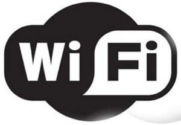

Un problema comune nei proprietari dell'iPhone è una diminuzione notevole della batteria man mano che si installano nuove applicazioni. In questo articolo andremo passo passo esaminando tutte quelle caratteristiche che fanno abbassare la durata della batteria dell'iPhone.

<!--more-->

### La luminosità

La luminosità è una delle cause di maggior consumo della batteria, c'è da dire che a meno che non ci si trovi con l'esposizione diretta del sole sullo schermo è inutile avere la luminosità al massimo, quindi conviene sempre diminuirla fintanto che è possibile leggere in maniera chiara dal display. Quello che può diminuire l'illuminazione è una pellicola non di buona qualità o con caratteristiche particolari. Una feature utilizzabile è la luminosità automatica, che aumenta la luminosità dello schermo in proporzione alla luminosità esterna.

### Il Wifi ed il bluetooth

Il Wifi sempre acceso tende a consumare la batteria dell'iPhone, anche se non si usa il wifi, il cellulare controlla sempre se è connesso in wifi consumando batteria. Quindi è buona norma attivare il wifi ed il 3g solo quando necessari. La stessa cosa vale per il bluetooth, questo in particolare viene spesso dimenticato acceso quando si usa il vivavoce in auto o se si usano delle casse/cuffie con questa tecnologia, è consigliabile spegnerlo sempre!

### Notifiche Push

Le notifiche push forniscono aggiornamenti in tempo reale dalle applicazioni, sono il problema principale del consumo energetico del nostro cellulare, ogni applicazione che ne fa uso controlla periodicamente la rete e quindi porta un consumo notevole. Le app più conosciute che usano le notifiche sono: Facebook, WhatsApp, Viber, Gmail, Dropbox, Fruit Ninja, Skype e Twitter. E' utile quindi attivare solo le notifiche necessarie e disattivare le altre. Così facendo si può avere un aumento notevole della durata.

Hai anche tu dei suggerimenti dei trucchi per allungare la vita al tuo iPhone? Scrivimi o commenta sotto l'articolo!
