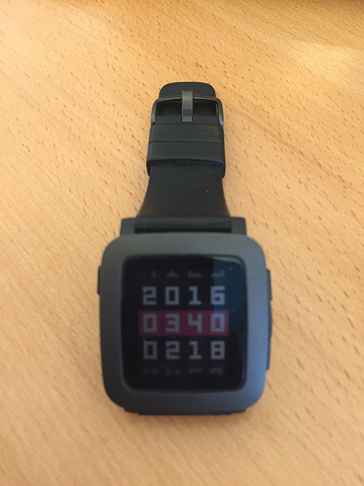

Come ho scritto in un post precedente utilizzo, ormai da diversi mesi, uno smartwatch Pebble Time ma non ne sono soddisfatto. Il punto è che fino ad oggi non hanno dimostrato (ne il Pebble ne gli altri ) alcuna killer feature, in particolare tutte le funzioni relative al fitness e alla salute come contapassi o cardiofrequenzimetro sono spesso poco precise e per quanto ad ogni aggiornamento dichiarino di migliorare i vari algoritmi basta uno starnuto per farti camminare due o trecento metri....

<!--more-->

Per quanto riguarda il cardiofrequenzimetro ce ne sono di vari tipi quindi diverse qualità. In particolare i modelli di Fitbit in grado di misurare il battito cardiaco dal polso sono risultati molto imprecisi tanto che in USA è iniziata una Class Action nei confronti dell'azienda, l'Apple Watch risulta invece abbastanza preciso ( se paragonato ad apparecchi professionali ) ma a patto di stringere molto il cinturino, rendendone quindi fastidioso l'utilizzo per tutta la giornata, senza contare che una giornata intera non restiste ed è sempre necessario ricaricarlo la notte o in ufficio. Il Pebble Time dura cinque/sette giorni ma non ha il cardiofrequenzimetro, ha inoltre il difetto del contapassi, testato più volte, ed in generale tutte le applicazioni risultano poco precise, ad esempio l'applicazione di Swim.com traccia solo le vasche fatte in stile libero e non quelle a rana ne quelle a dorso.

In conclusione la maggior parte dei wereable ad oggi sono semplicemente dei giocattolini tecnologici che forniscono dei dati molto approssimativi sul proprio allenamento. La parte fitness è quella fondamentale per questi device che altrimenti risulterebbero semplicemente dei secondi display del proprio smartphone ma ad oggi non è ancora sufficientemente matura, non ci resta che aspettare la prossima generazione di Apple Watch che probabilmente porterà dei miglioramenti da questo punto di vista.
