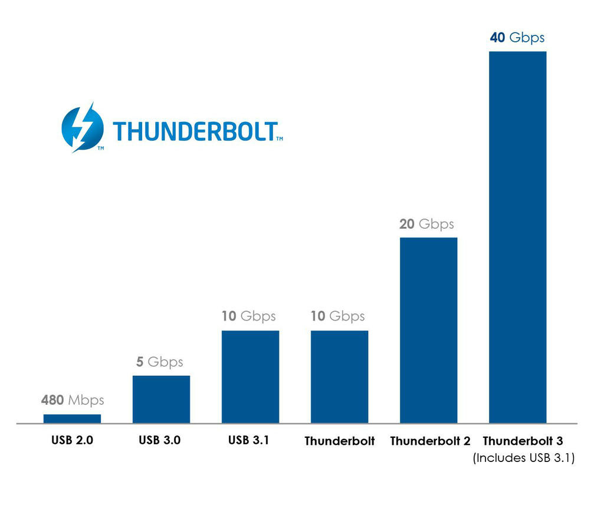

Sia Razer che Alienware sono brand specializzati nella creazione di computer per videogiocatori e in particolare di portatili. Il problema principale dei portatili è che se si vogliono prestazioni paragonabili a quelle di un PC è necessario non solo spendere molto ma anche sacrificare la portabilità. I laptop gaming sono solitamente molto pesanti e grandi in quanto necessitano di schede grafiche (GPU) molto performanti che tipicamente arrivano a temperature molto alte e consumano molta corrente, per far fronte a queste caratteristiche sono necessari impianti di raffreddamento appositi e la durata della batteria ne soffre parecchio.

<!--more-->

[Ti interessano notebook per il gaming? Dai un occhio qui!](http://www.amazon.it/s/ref=as_li_ss_tl?_encoding=UTF8&camp=3370&creative=24114&field-keywords=alienware&linkCode=ur2&rh=i%3Aaps%2Ck%3Aalienware&tag=giuseppefit-21&url=search-alias%3Daps)

Per questo motivo prima Alienware e poi Razer hanno sviluppato dei box esterni dove inserire una scheda grafica dedicata per poi collegarla al portatile, il principio è quello di avere un portatile con performance "normali", quindi con una scheda grafica integrata o di bassa potenza, poi quando si è a casa e si vuole giocare si collega il box al portatile e si sfrutta la scheda grafica esterna. Non è sicuramente pensabile di portare con se anche il box che ha un peso vicino a quello del portatile avendo anche un altro alimentatore all'interno.

Mentre Alienware sfrutta una connessione proprietaria, presente quindi solo sui suoi notebook, Razer ha scelto di usare la porta Thunderbolt 3 presente sui device di nuova generazione con processori Intel Skylake che arriva alla velocità di trasferimento di 40 Gbps. [Per info sulla tecnologia Thunderbolt.](https://thunderbolttechnology.net/blog/thunderbolt-3-usb-c-does-it-all)

Per ulteriori informazioni sulla proposta Razer ti invito a visitare [questo link](http://www.tomshw.it/news/amd-xconnect-scheda-video-esterna-tramite-thunderbolt-3-75056).
La cosa che più mi ha colpito di questa soluzione è l'utilizzo tramite schede grafiche AMD e drive appositi su windows 10, in particolare è possibile collegare la scheda anche a portatile acceso, come fosse una pennina USB, senza bisogno di riavviare il sistema.

L'argomento delle schede grafiche esterne è un argomento del quale si parla parecchio su internet e in forum di smanettoni che hanno costruito i propri sistemi di eGPU (external GPU), utilizzando le porte USB 3 o le thunderbolt (1 e 2). In particolare su [questo sito](https://odd-one-out.serek.eu/thunderbolt-2-egpu-setup-using-akitio-thunder2/) l'autore descrive come utilizzare una GeForce 970 esterna. Il problema principale è il costo dei componenti da assemblare, alimentatore, box e scheda grafica, senza essere poi sicuri di sfruttarne a pieno la potenza.

Anche MSI sta lavorando su un box esterno del genere, [per info.](http://www.kitguru.net/components/graphic-cards/anton-shilov/msi-preps-external-graphics-solutions-with-thunderbolt-3-interface/)
