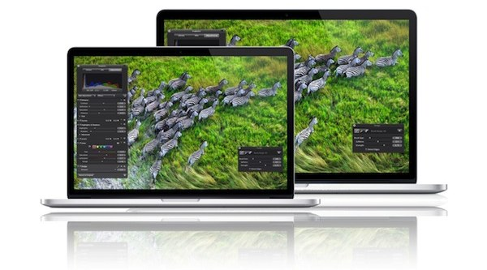
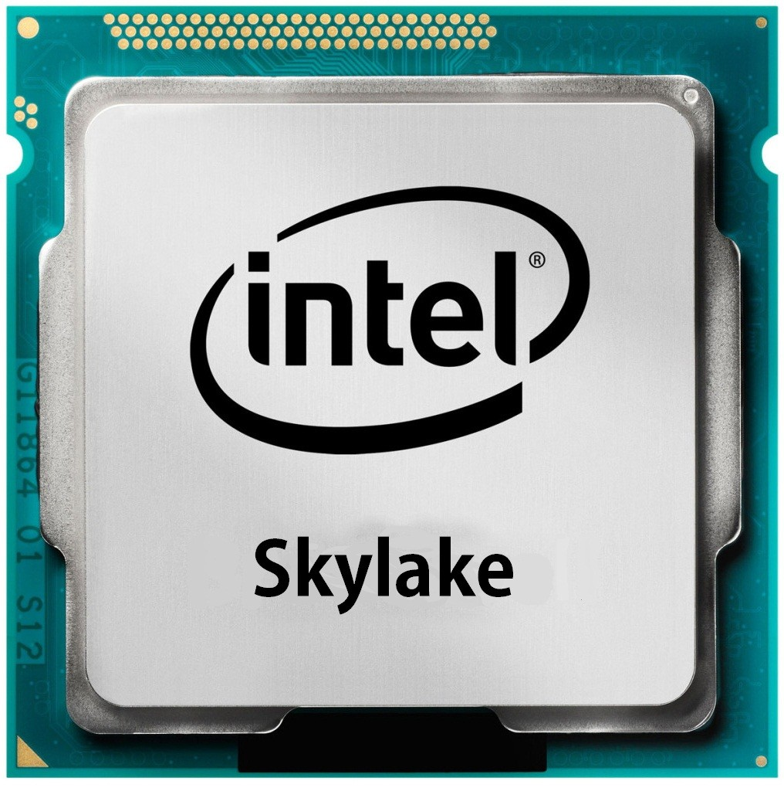
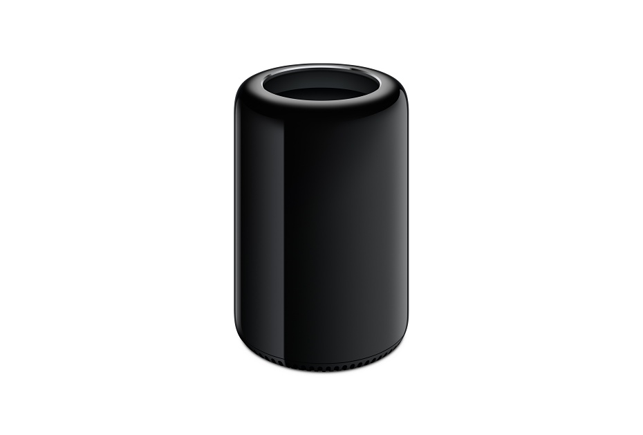

Probabilmente a breve saranno presentati i nuovi MacBook Pro sia da 13 che da 15 pollici. Vorrei elencare in questo articolo quelle che sarano molto probabilmente le principali caratteristiche dei nuovi modelli di laptop professionali di **Apple**.

<!--more-->

### Processori Skylake

Skylake è il nome in codice della nuova architettura di processori Intel entrati in commercio ormai da diversi mesi. Questi nuovi processori oltre ad avere dei consumi inferiori ai modelli precedenti, portando quindi ad una maggiore durata della batteria, garantiranno un aumento di performance, soprattutto dal punto di vista grafico, quest'ultimo molto utile per il modello da 13" che non integra un chip video dedicato. Continueranno ad essere divisi tra i3, i5 ed il top di gamma i7 ed i modelli Pro monteranno i5 ed i7.

### Grafica migliorata

Come detto prima i modelli da 13" avranno un chip grafico più performante, ma un miglioramento ci sarà anche per i 15" che probabilmente monteranno una Nvidia 960M con almeno 2GB di ram.

### Connettività

Dal punto di vista della connettività i nuovi Mac avranno le nuove porte Intel Thunderbolt 3. Apple fu la prima azienda a montare sui propri portatili la prima versione di thunderbolt ed ora il suo ultimo aggiornamento vanta velocità di trasmissione dati quattro volte superiori, arrivando a 40Gbps. Da notare come avere questa porta dia la possibilità dell'utilizzo di una scheda grafica esterna come discusso in [questo articolo](http://giuseppefrattura.website/tech/2016/03/13/Le%20eGpu/).

I nuovi Mac disporranno anche delle nuove porte USB-C già presenti sul macbook 12".

### Conclusioni

In conclusione i nuovi macBook pro dovrebbero avere una configurazione molto simile agli attuali Dell XPS da 13 e 15 pollici, solo con la possibilità di avere Mac Os X come sistema operativo ed un prezzo sicuramente più alto.

### Altro?

C'è un altro prodotto che probabilmente verrà aggiornato, il MacPro. Il MacPro è il computer Apple dedicato ai professionisti ma l'attuale versione malgrado il prezzo non supporta gli standard di realtà virtuale.

