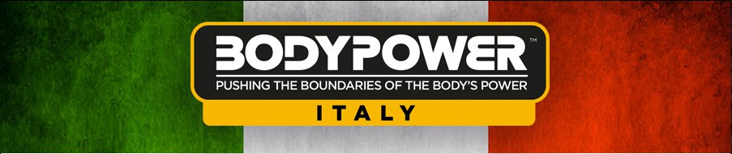
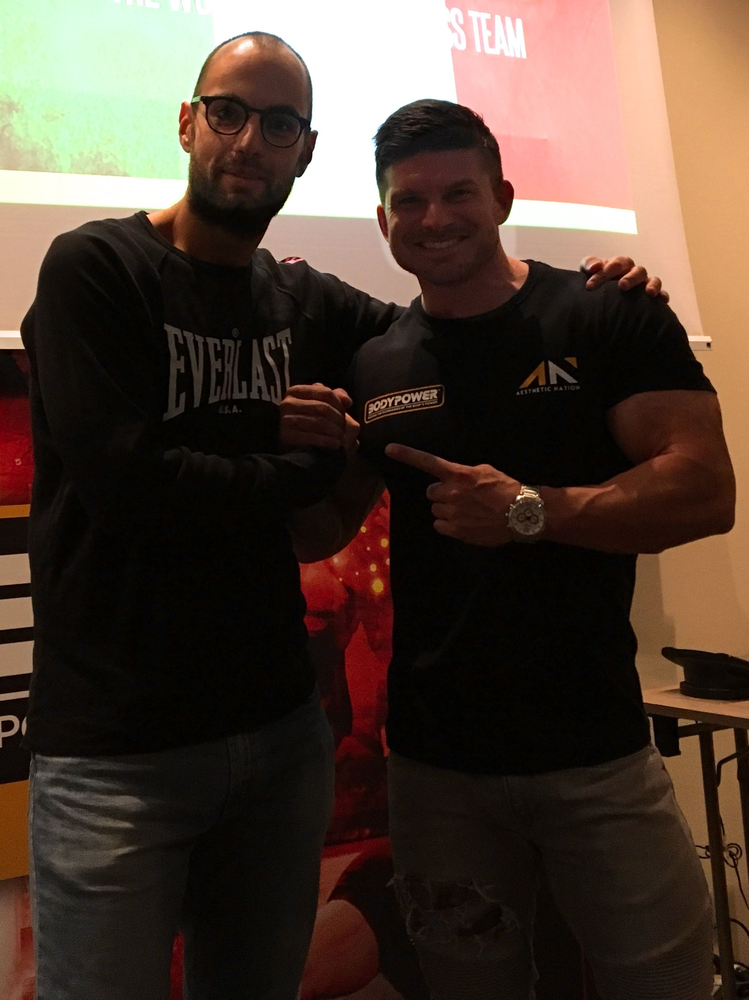
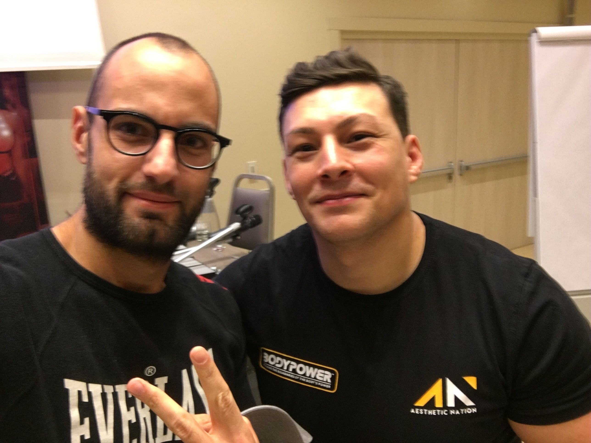

Il 16 Ottobre si è tenuto a Milano il primo evento Bodypower in Italia. Si tratta di una fiera del fitness molto conosciuta sia in Inghilterra che in India.

<!--more-->

In Italia una delle fiere più conosciute sul fitness è la Rimini wellness, invece all'estero ce ne sono moltissime.
[Rimini wellness](www.riminiwellness.com) è diventata ormai il punto di riferimento per tutti gli atleti italiani.

Bodypower intende promuovere ogni variante del fitness, dal culturismo all'aesthetics, dal powerlifting al crossfit e per questo ai suoi eventi partecipano sempre alcuni tra i migliori esponenti di questi sport. In particolare hanno scelto di invitare per la prima edizione Tom Coleman e Alex Ferentinos. Coleman si è allenato la mattina con alcuni ragazzi poi durante la giornata ha parlato delle gare di Fitness condividendo quelle che sono state le sue esperienze con i presenti.

Alex Ferentinos ha invece parlato di come alimentarsi per migliorare le proprie performance sportive, passando dalla quantità di acqua da bere ai macronutrienti ed al loro effetto sulle nostre performance ma anche sulla variazione di massa magra e grassa.

In conclusione ritengo il Bodypower un evento molto interessante e mi auguro ritornino in Italia magari con un evento più grande.
