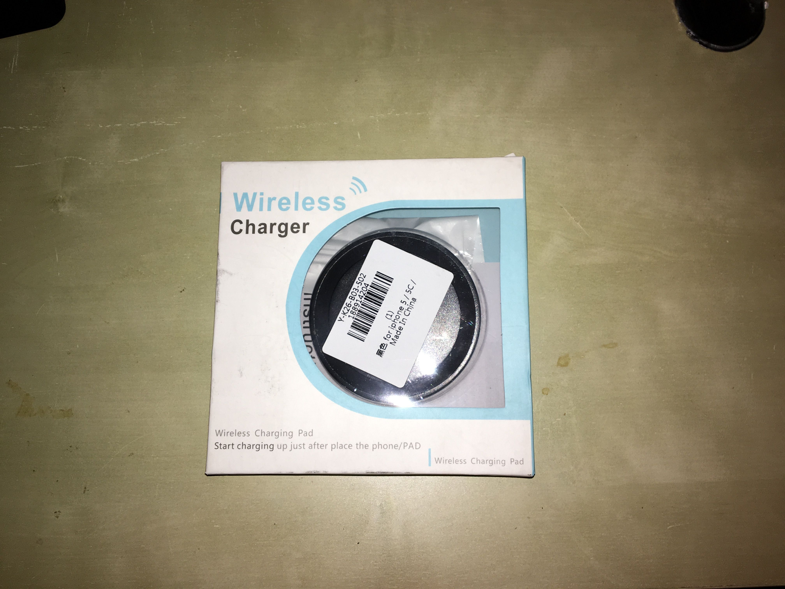
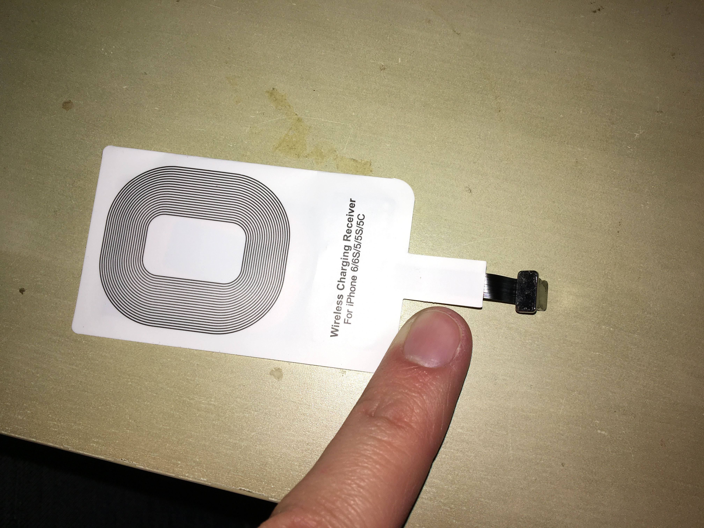

Da Gearbest ho acquistato una nuova cineseria, un kit per ricaricare wireless l'iPhone come possibile con alcuni device Samsung e di altre marche.

Il kit consiste in due pezzi: il primo è la base di ricarica che funziona con un qualsiasi cavo USB-c; il secondo componente va inserito sull'iPhone con il connettore lightning e può essere tenuto fermo da una cover non troppo spessa (io uso una in silicone molto sottile).

### Vantaggi e svantaggi

Parliamoci chiaramente non è un dispositivo che ti cambia la vita ma qualche piccola comodità la offre. In particolare per caricare il cellulare basta poggiarlo sulla base e niente più, il difetto è che una volta collegato il chip all'iPhone non è possibile collegarlo al pc per scambio dati o sincronizzazione ma è necessario effettuare la sincronizzazione via WiFi.

Se sei interessato trovi il caricatore wireless per iPhone [qui](http://www.gearbest.com/power-banks/pp_426411.html?lkid=10208339)
