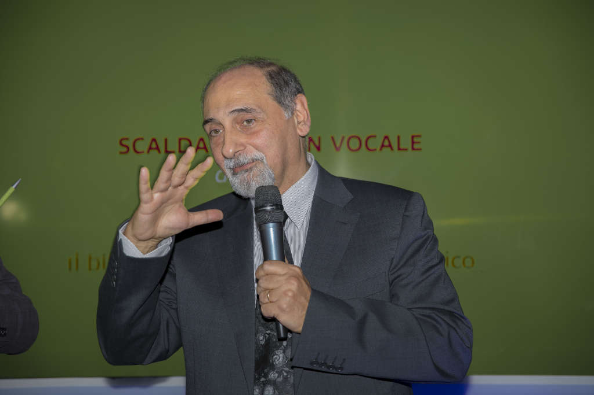
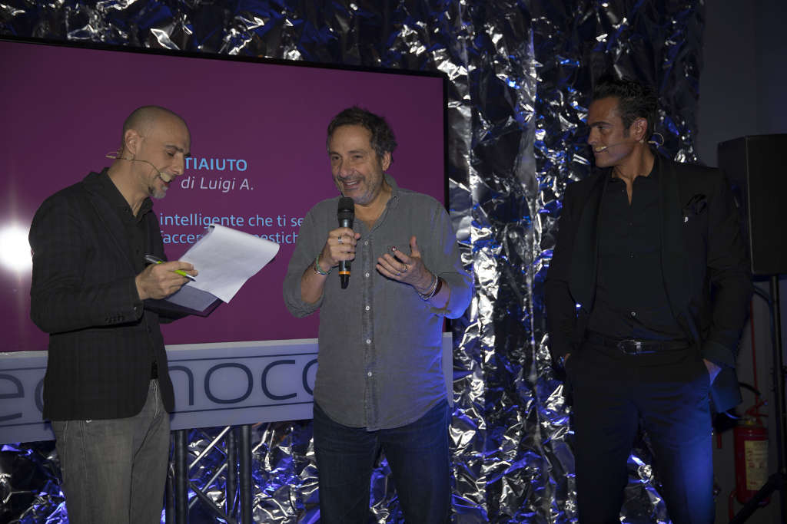
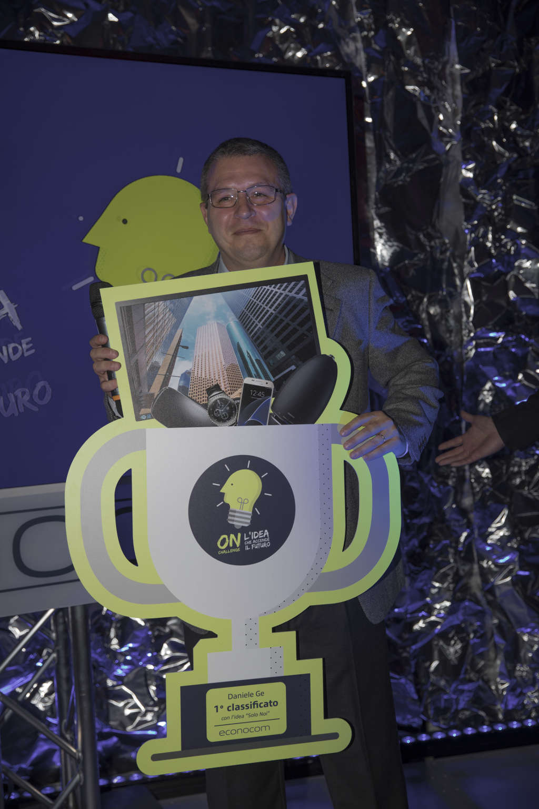

Il 15 Dicembre si è tenuto l'evento "The future is on" di Econocom per premiare il vincitore dell'omonimo concorso.

Del concorso Econocom ho già scritto in [questo articolo](), si tratta in sostanza di un contest nel quale proporre idee innovative, il vincitore avrebbe vinto svariati premi Samsung.

Durante la serata condotta da Maurizio Melis di Radio 24 sono intervenuti numerosi ospiti tra i quali Umberto Guidoni e Mario Tozzi, si è parlato molto di innovazione e dei rischi che bisogna prendere per innovare. Con guidoni si è parlato delle possibilità di andare su Marte e con Tozzi del fatto che ormai conosciamo meglio lo spazio ed i pianeti rispetto all'interno della terra.

Il vincitore del concorso è stato Daniele Ge, con l'idea: con il progetto "Solo Noi", su dei braccialetti per le coppie in grado di scambiarsi messaggi crittografati via hardware e non solo software come fatto ad esempio da WhatsApp.

Altri progetti, non vincenti, sono stati poi mostrati su una tv al centro della sala, come ad esempio un bicchiere intelligente che ti avvisa tramite notifiche sul cellulare quando bere, uno scalda biberon che si attiva quando sente il pianto di un bambino, un casco di realtà virtuale per limitare la perdita di memoria nelle persone anziane.
