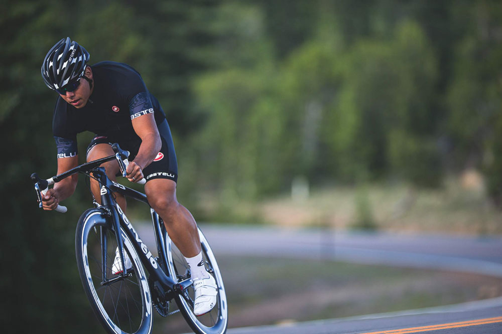

La primavera è alle porte e ritornano le belle giornate con una temperatura ideale per una bella scampagnata. Cosa di meglio allora per una bicicletta per qualche pedalata?

Vivendo a Milano come sport oltre ad andare in palestra corro. Amo Milano perché nelle zone centrali è attrezzata con parchi mentre nelle zone periferiche è possibile fare delle piacevoli scampagnate nelle campagne, soprattutto nei giorni primaverili dove si apprezza di più il paesaggio e si respira un po' di aria pulita.

Il gruppo [**Focus Bikes Italia**](http://l12.eu/focus-bike-addict-1386-au/VGX10QFHU80KJ9MPC45V) ha da poco aggiornato il suo [sito](http://l12.eu/focus-bike-addict-1386-au/VGX10QFHU80KJ9MPC45V) con un elenco molto curato di bici da scegliere in base ai propri bisogni. Da quella per andare sullo sterrato a quella per la città con pedalata assistita.

Il sito oltre ad avere questo elenco di bici permette anche di trovare un rivenditore fisico nelle proprie vicinanze dove magari provare le bici.

Se vi va fetevi un giro, in bici e se no l'avete andate sul sito di [Focus Bikes Italia](http://l12.eu/focus-bike-addict-1386-au/VGX10QFHU80KJ9MPC45V).

