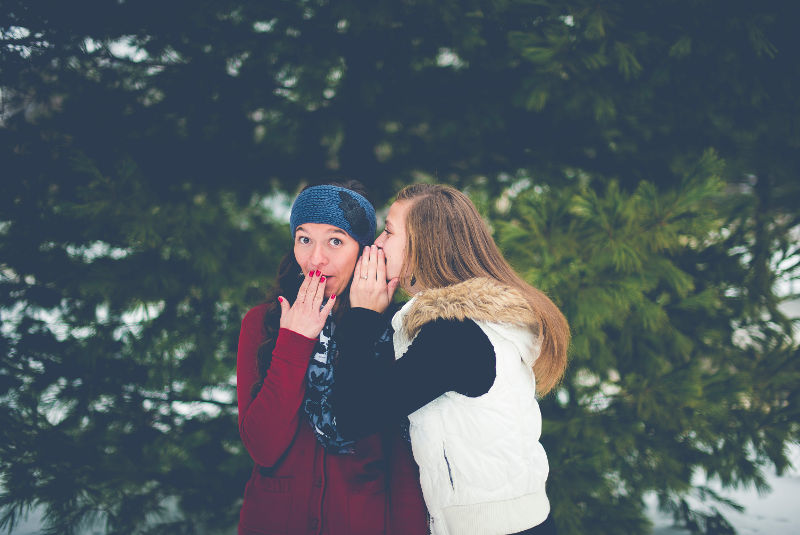

In questo post vorrei fare una mia riflessione personale su cosa sia la libertà di parola, sul perché credo che questa vada sempre rispettata anche e soprattutto quando chi parla non la pensa come noi. Un argomento sempre più trattato su internet ed anche una delle tante libertà che abbiamo in Italia e che in tanti altri paesi purtroppo non esiste.

<!--more-->

Ultimamente ho letto la notizia di [Alessandro Gassman](https://twitter.com/gassmangassmann) che è "uscito" da Twitter dopo le numerose critiche su un post dove esprimeva la sua opinione personale sullo "Ius soli", la legge che vincola come possa essere assegnata la cittadinanza italiana. Senza entrare nel merito della questione credo sia giusto che una persona esprima il proprio parere su di una legge del proprio paese. Sicuramente è molto importante fare vera informazione a riguardo ma il fatto che un personaggio molto seguito come Gassman ne parli può portare i suoi followers ad interessarsi all'argomento.
