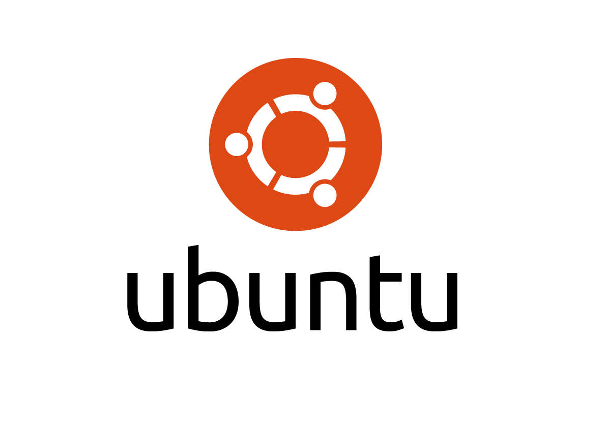
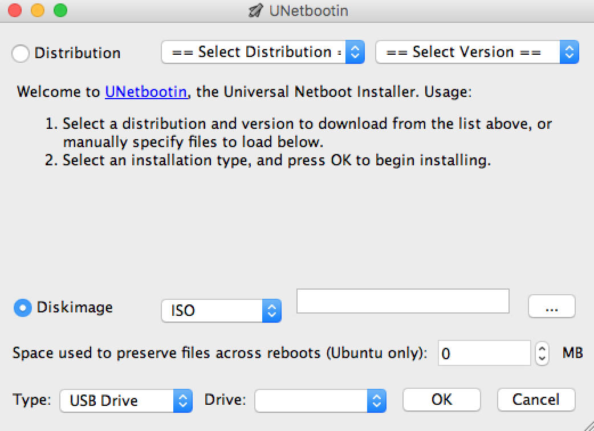

Quando qualcosa non funziona nel nostro pc e non riusciamo più a farlo partire, prima di formattarlo possiamo provare a ripararlo o almeno fare i backup dei dati tramite una versione live di Linux. In questo articolo ti spiego come creare da Mac OS una versione di Ubuntu che possa partire da USB.

Ubuntu è una delle distribuzioni di Linux più conosciute e facili da usare, molti uffici sono riusciti a passare da Windows a Ubuntu senza troppi problemi per la formazione o senza avere cali di produttività. Ci sono numerose applicazioni, sia per la produttività che per la gestione del sistema. Inoltre è possibile utilizzare Ubuntu (e anche molte altre distribuzioni) in modalità **Live**, ovvero senza installarle su di un disco fisso, proprio per questo motivo queste versioni sono molto utilizzate per il salvataggio di dati o per fixare problemi su di un sistema che non riesce più a partire.

Per creare una versione di Ubuntu che parta dalla penna usb da Mac è necessario utilizzare un piccolo software gratuito, [unetbootin](https://unetbootin.github.io).

Bisogna prima di tutto avere una penna usb da almeno 2GB, formattarla con 'Disk Utility' selezionando il file System MS-DOS (FAT) e lo schema GUID Partition Map.

Ora bisogna avere la ISO di Ubuntu scaricabile dalla [pagina ufficiale](https://www.ubuntu.com/download)

Non essendo fatto da sviluppatori certificati probabilmente Mac OS non permetterà l'esecuzione di unetbootin, dovrai quindi andare nelle preferenze del sistema, nella pagina 'Security & Privacy' e premere il bottone "Open Anyway"

A questo punto dall'applicazione seleziona "diskimage" -> ISO e il percorso dell'imagine di Ubuntu che hai scaricato. Come Type seleziona invece 'USB Drive' ed inserisci il path della penna USB, se hai una sola penna inserita apparirà quello giusto subito.

Premi ok, e vedrai la barra di avanzamento dell'installazione. Una volta finito la penna sarà pronta.

Se vuoi far partire Ubuntu da un Mac devi premere il pulsante Option / alt /⌥ durante l'avvio, su altri sistemi dovrai accedere al BIOS ed impostare nell'ordine di boot la penna usb come prima.
