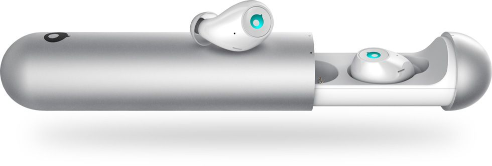

Seguo molti progetti su kickstarter, uno che mi ha convinto abbastanza da spenderci dei soldi è stato quello delle auricolari Air di Crazybaby. Si tratta di auricolari wireless bluetooth molto piccole da inserire all'interno dell'orecchio, simili come idea alle Ear Pods di Apple.

<!--more-->

Al momento del mio finanziamento (non acquisto) quest'azienda vendeva già due prodotti riguardanti l'audio e la connessione bluetooth [Mars](https://crazybaby.com/mars) e [Luna](https://crazybaby.com/luna) e questo mi ha convinto sulla fattibilità del progetto.

Con oltre sei mesi di ritardo sono arrivate a casa mia le Air, e le mie impressioni a caldo sono state ottime.

<iframe width="560" height="315" src="https://www.youtube.com/embed/vakJEbmeVXw?rel=0" frameborder="0" allowfullscreen></iframe>

### I Pro

Il design è veramente molto curato, entrano perfettamente nelle orecchie e non sporgono fuori. L'astuccio è molto bello, in alluminio satinato e gli auricolari sono attratti magneticamente.
La qualità audio è davvero alta per le dimensioni delle cuffie, per quanto non facciano gridare al miracolo hanno dei toni alti di buona qualità, dei medi ottimi e dei bassi più che soddisfacenti viste le dimensioni.

### I contro

Il pairing bluetooth con l'iPhone è facile, mentre invece non sono ancora riuscito a capire come rieffettuare il pairing con un altro device, da questo punto di vista le classiche cuffie bluetooth sono più semplici. Inoltre danno un problema di trasmissione dell'audio strano, se lascio il cell in camera mia e cammino per casa con le cuffie ascolto perfettamente la musica per diversi metri (in pratica tutta la casa).
Un altro piccolo difetto è come queste cuffie debbano essere caricate. Prima ho scritto che si collegano magneticamente al loro astuccio, purtroppo però non vanno subito in carica ma bisogna spostarle di qualche millimetro e ruotarle per fare in modo che inizino a essere ricaricate.
