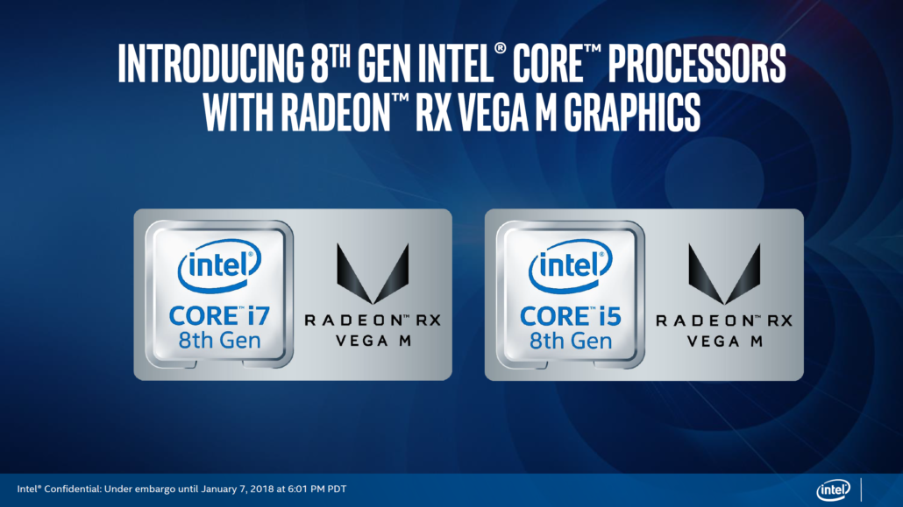
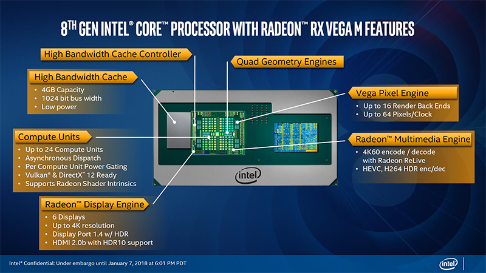
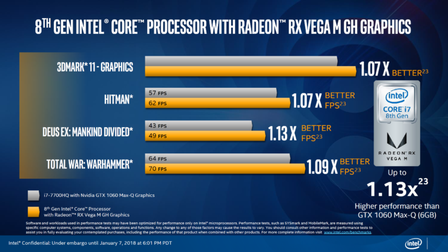

Intel ha unito le sue CPU ad alte prestazioni con una potente GPU discreta di AMD e l'ultima generazione di memorie ad alta larghezza di banda (HBM2), tutti interconnessi con il loro ultimo ponte di interconnessione multi-die incorporato o EMIB.

<!--more-->

Il chip presenta un'implementazione unica di condivisione dell'energia tra CPU e GPU ed è la prima soluzione consumer ad utilizzare EMIB e anche la prima soluzione mobile consumer ad utilizzare HBM2.

Intel garantisce il supporto all'overclock. I vari SKU saranno configurati in varianti da 65 W e 100 W. Rispetto ad una normale piattaforma mobile con CPU e GPU discreta, i nuovi chip risparmiano oltre 1900 mm2 di spazio su scheda. Il chip mantiene l'altezza della CPU e della GPU a soli 1,7 mm riducendo l'ingombro di silicio del 50%.

GPU e HBM2 sono collegate direttamente tramite EMIB mentre la CPU è collegata alla GPU tramite PCI Express Gen 3 che dovrebbe fornire il throughput necessario per alimentare carichi di lavoro grafici intensivi.

La funzionalità di condivisione dinamica dell'energia è una delle caratteristiche più interessanti. CPU e GPU condividere e bilanciano l'energia in base al carico di lavoro dell'applicazione. Quando al sistema operativo serve maggiormente l'utilizzo della scheda grafica (come ad esempio nei giochi) a questa sono destinate più risorse, mentre durante il multi-tasking, questa potenza è data alla CPU.

Questo sistema è noto come Dynamic Tuning e funziona controllando lo stato di CPU e GPU.

Tutti gli SKU sono dotati di una CPU quad core con otto thread attivi, 8 MB di cache L3 e supporto di memoria DDR4-2400. Le frequenze più alte per la CPU riportate sono di 3,1 GHz che arrivano a 4,2 GHz con il Turbo Boost 2.0 è comunque presente anche la scheda grafica integrata Intel HD Graphics 630.

Esistono al momento due schede grafiche che saranno abbinate a questi processori e sono le Radeon RX Vega 24 (Radeon RX Vega M GH Graphics) e Radeon RX Vega 20 (Radeon RX Vega M GL Graphics).

Entrambe le schede grafiche hanno 4 GB di memoria HBM2.

I processori Intel di ottava generazione con grafica Radeon RX Vega M arriveranno nella primavera del 2018. Intel ha dichiarato che questi dispositivi non saranno solo per sistemi portatili ma anche per PC di dimensioni ridotte come i NUC di Intel.

Le prestazioni dovrebbero essere leggermente superiori ad un processore intel di settima generazione con una scheda grafica nvidia 1060. Questi processori con scheda grafica dedicata potrebbero essere usati anche nei prossimi macbook pro, resta da vedere se solo nei modelli da 15 pollici o anche nei più piccoli.
