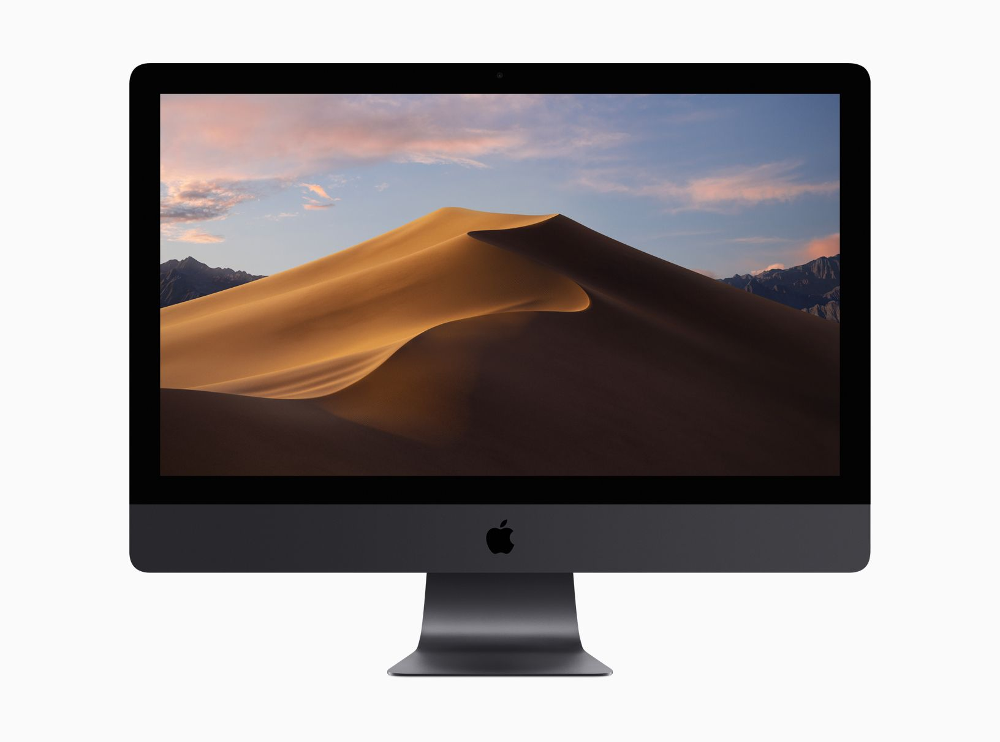
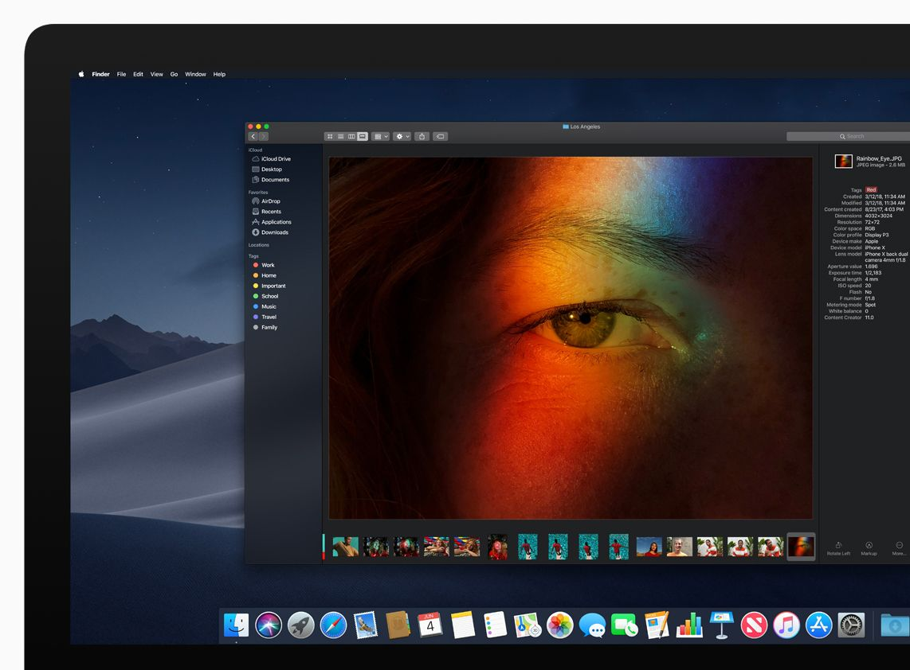
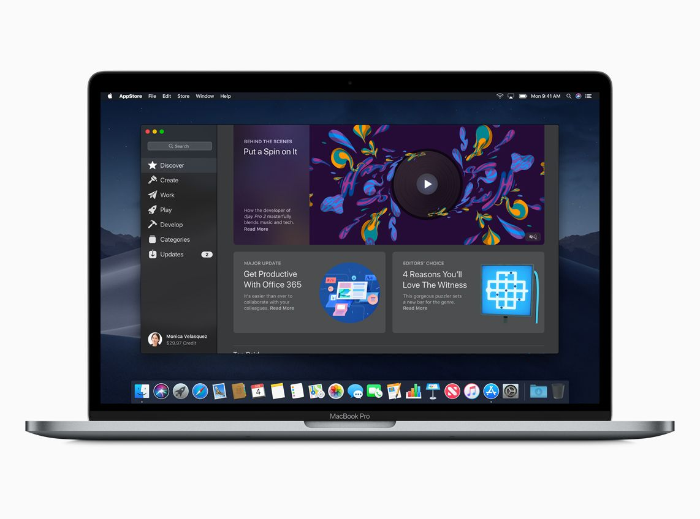
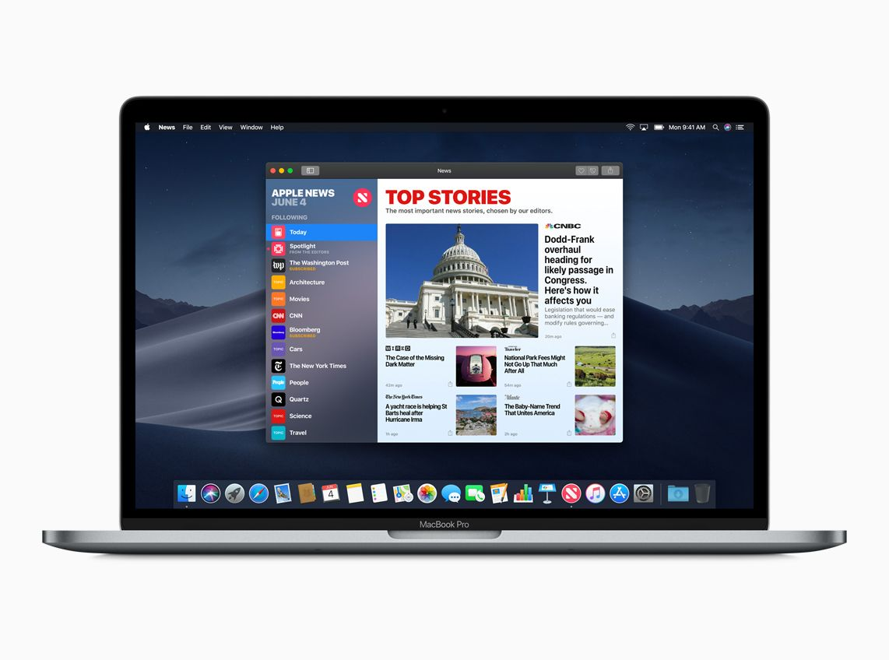
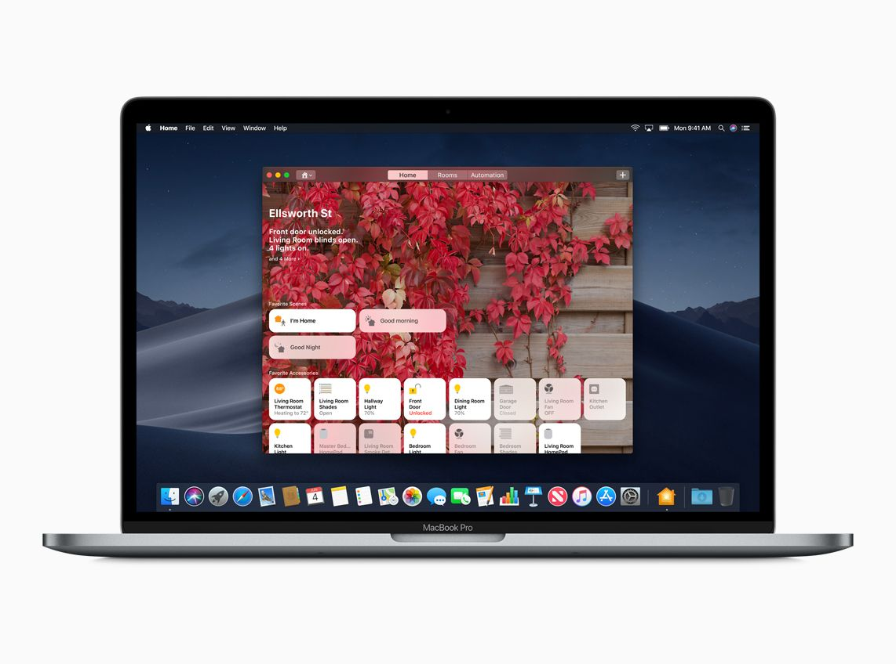
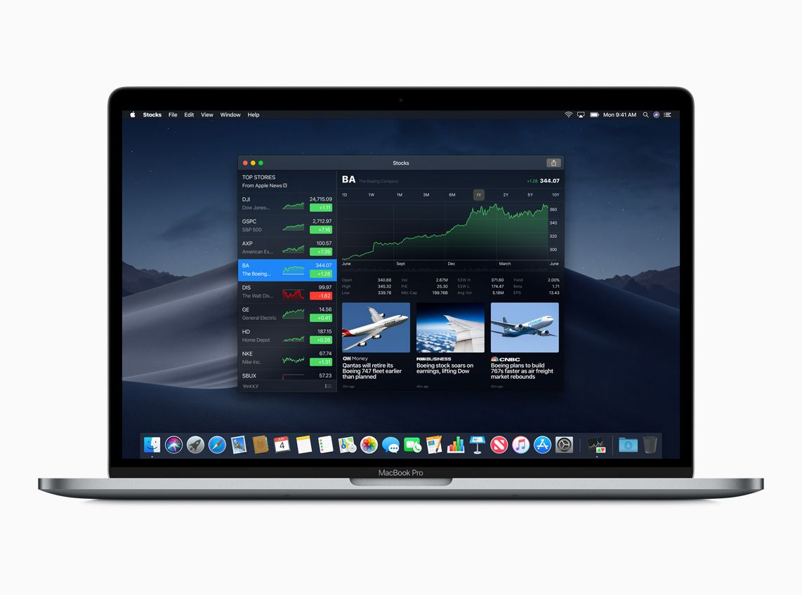
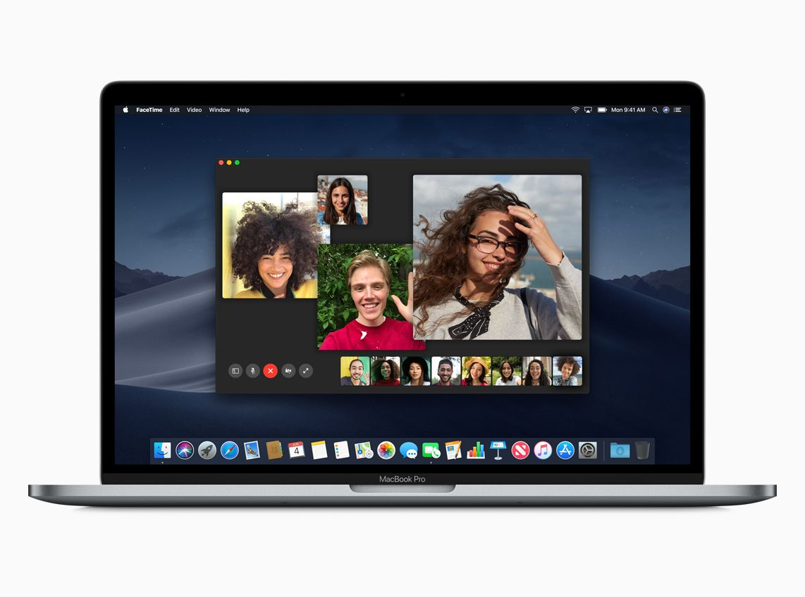

Lo scorso quattro Giugno Apple ha presentato il suo nuovo sistema operativo per Mac chiamato **Mojave** al WWDC 2018. Apple ci ha abituati a nomi prima di felini e dopo di luoghi molto belli come il parco Yosemite o appunto il deserto Mojave.

### Dark Mode

La dark mode permette un'esperienza desktop completamente diversa, preferendo ai tipici toni chiari, toni scuri. Tutte le app native (Mail, Messaggi, Mappe, Calendario e Foto) avranno un supporto alla dark mode.

### Nuovo Mac App Store

Il Mac App Store è stato ridisegnato per dare un'esperienza utente simile a quella della sua versione mobile.

### Dynamic Desktop

Se si hanno sul desktop file diversi dello stesso tipo, ad esempio immagini o fogli Excel, questi possono essere raggruppati e visti come un'unica icona in modo da mantenere il desktop più in ordine. È possibile raggruppare i file non solo per tipo ma anche per dei tag assegnati dall'utente. La finestra di anteprima (quella che appare quando si preme lo spazio su un'icona) mostrerà anche i metadati del file esaminato.

### Nuove app native

Mac Os Mojave copia da iOS alcune app di successo come News, Stocks, Registrazioni e Casa. Tutte le app avranno le stesse funzionalità della versione mobile ma con un'interfaccia ottimizzata per l'uso di mouse e tastiera.

### Facetime

Facetime permetterà di effettuare videochiamate di gruppo creando un mosaico con i video di tutti i partecipanti.

### Privacy e Sicurezza

Privacy e sicurezza sono due temi molto importanti per Apple, il suo CEO Tim Cook ha pubblicamente rimproverato Mark Zuckerberg per la poca privacy sul suo social network. Su questo tema sono state fatte varie migliorie in particolare a Safari che ora ha un sistema denominato **Intelligent Tracking Prevention** che blocca la possibilità di essere tracciati senza permesso quando si utilizzano i social network. Safari ora permette anche di creare, riempire in automatico e memorizzare le password dei siti che visitiamo.

### Altre funzionalità sono:

- La possibilità di effettuare degli screenshot e di registrare il video del proprio schermo è stata migliorata.
- **Continuity** funziona anche sulla fotocamera del proprio iPhone, sarà possibile scattare una foto dal cellulare e averla (quasi) istantaneamente sul proprio Mac.
- I tool di markup sono integrati in Finder, Anteprima e negli screenshots, rendendo più semplice la creazione ed associazione di tag ad uno o più files.

### Novità per gli sviluppatori

#### Create ML

Create ML è una tecnologia per il training di modelli di Machine learning. Dopo aver investito sul Machine Learning e sull'AI sugli iPhone X Apple decide di portare queste feature anche su Mac. Create ML funziona con Swift e playgrounds.

#### Natural Language framework

Il framework per l'elaborazione del linguaggio naturale è un nuovo framework per analizzare il linguaggio naturale sotto forma di testo ed estrarre informazioni specifiche. È anche possibile usare questo framework insieme al Create ML per fare il training di modelli personalizzati di Natural Language processing.

#### Deprecazione di OpenGL e OpenCL

Sono state dichiarate deprecate le API OpenCL e OpenGL, questo significa che per il momento continueranno a funzionare ma in un prossimo futuro non sarà possibile utilizzare applicazioni che ne facciano utilizzo penalizzando in particolar modo i già pochi giochi presenti su Mac. Una scelta che ha fatto molto discutere ma che serve per aumentare l'adozione di applicazioni che utilizzino la libreria fatta da Apple chiamata **Metal**.

Il **Mac App Store** ri-progettato include un nuovo sistema di rating e di review con le rispettive API.

Il **framework Network** rende più facile la creazione di connessioni all'interno di una rete e con esse lo scambio di dati e la sicurezza.

L'ultima novità è la possibilità, a partire dal 2019, di utilizzare le API di iOS su mac. Le nuove app come News e Borsa sono state implementate sfruttando appunto queste API.

La developer preview di Mac OS Mojave è già disponibile per gli sviluppatori paganti Apple. A fine mese renderanno possibile provare la beta publica agli iscritti al programma beta.
Mojave come i suoi predecessori sarà disponibile come aggiornamento gratuito. Per tutti i Mac dal 2012 in poi e per i Mac Pro dal 2010.
