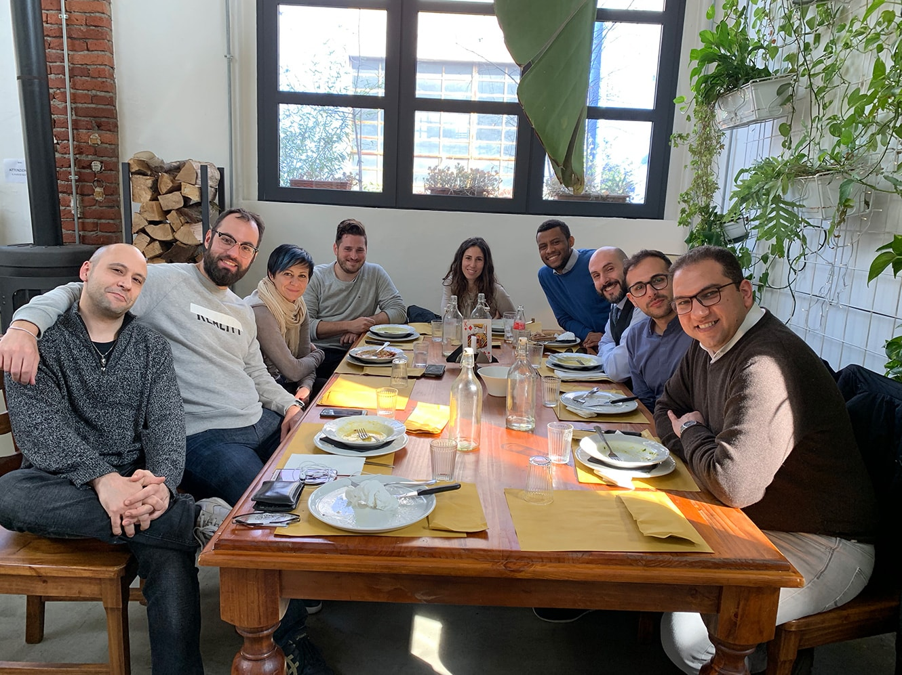

Dal 5 marzo 2018 al 28 Febbraio 2019 ho avuto la fortuna di lavorare con persone stupende, scrivo questo articolo per raccontarvele.

<!--more-->

Dal 5 marzo 2018 al 28 Febbraio 2019 ho avuto la fortuna di lavorare con persone stupende, scrivo questo articolo per raccontarvele.

Nei vari anni in cui ho lavorato da consulente informatico ho incontrato tante situazioni diverse, alcune buone altre meno. Non sto qui a fare una classifica ma negli ultimi giorni ho lasciato un gruppo di lavoro dove sono stato davvero bene, un gruppo di persone con le quali non mi sono forse mai sentito un collega ma un amico.

Poi i pranzi fuori, le partite a calcetto e l'atmosfera serena (spesso) a lavoro che ti permette di lavorare il giusto e bene, invece che tanto e male. È normale a volte scontrarsi con un collega per un motivo lavorativo ma un ambiente tranquillo permette di rilassare gli animi e chiarirsi per lavorare con più sinergia capendo le necessità degli altri componenti del team con una mansione differente dalla propria.

La consulenza non ha tante regole ma una di queste è che quando sei terrone e "scendi" al tuo paese quando ritorni devi portare qualcosa ai colleghi, e allora taralli e pasticciotti pugliesi, pastiere e sfogliatelle campane à gogo e quando invece non sei del sud o semplicemente ti piace cucinare la torta la fai a casa e la porti in ufficio.

C'è poi la regola aurea della risoluzione dei bug: "la colpa è del frontend!".

Altra frase tipica è "ma chi ha scritto questo codice di m..." e poi con il git blame si scopre che tipicamente l'autore della malefatta è proprio colui che se ne lamenta.

Battute a parte sapere di poter contare sull'aiuto di un collega quando si lavora è un qualcosa di stupendo, non necessariamente una persona che ti si mette a disposizione alzandosi dal suo posto ma anche solo che ti da una dritta tipo "guarda là" oppure "fa attenzione da un'altra parte".

Insomma un bel gruppo lo si riconosce anche dalla collaboratività dei colleghi e per quanto possa sembrare un concetto banale in realtà lo si trova davvero raramente.

Mi mancherete!
