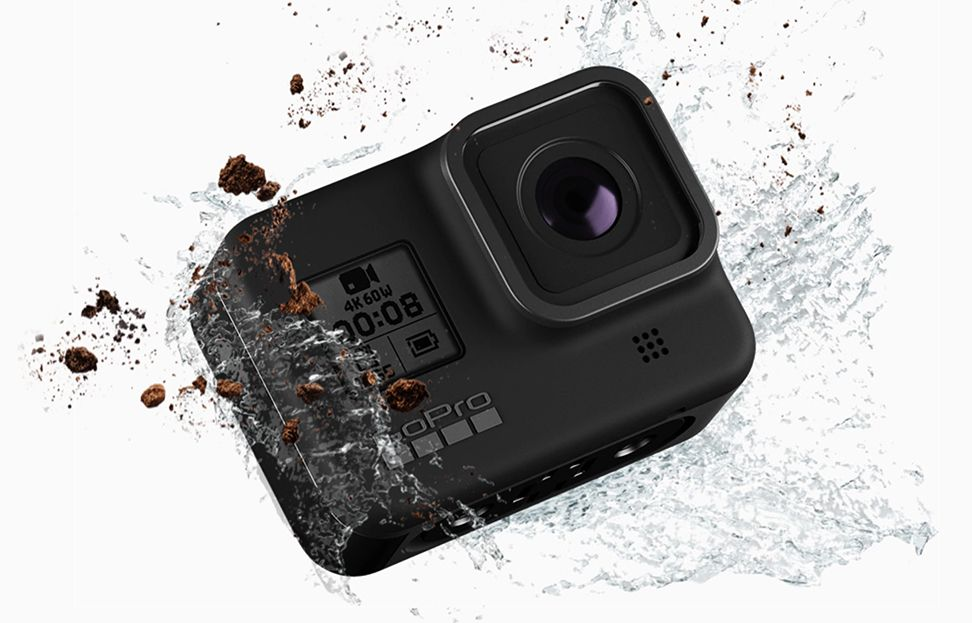

Dopo più di un anno dall'annuncio della Hero 7 GoPro ha annunciato la nuova versione della sua action cam. Il grosso problema è l'entrata in scena dell'action cam di DJI qualitativamente ad un livello molto simile se non superiore e con un prezzo più basso.

### Mount innovativa
GoPro sta da anni migliorando la sua action cam per renderla sempre più completa e anche più semplice. I primi modelli necessitavano di una custodia per andare sott'acqua, dal modello 5 invece la camera era subacquea fino a 10 metri senza bisogno di alcun accessorio ma per poter utilizzare i vari attacchi c'era comunque bisogno di una cover. Ora invece il gancio per utilizzare gli accessori è integrato nella camera.

### Moduli opzionali
Su youtube ci sono tanti vlogger che usano abitualmente una gopro usando spesso accessori di terze parti per migliorare l'audio, aggiungere una luce o un grip. GoPro finalmente ha intuito la possibilità di guadagnarci direttamente, per questo ha lanciato una serie di accessori che trasformano la gopro hero 8 (solo quella) in una perfetta videocamera da vlogger, grazie ad un microfono direzionale, una luce led ed un display che mostra l'inquadratura quando si è davanti l'obiettivo.

### HyperSmooth 2.0
Ci sono anche miglioramenti dal punto di vista delle funzionalità. L'hypersmooth è la stabilizzazione elettronica offerta dal modello 7 è stato ulteriormente migliorato.

### Time Warp 2.0
Il Time Warp anch'esso già presente nella gopro 7 consente di creare filmati stabili anche quando si è in movimento utilizzando un numero molto ridotto di frame, avendo quindi un video molto più breve del girato.

<iframe width="560" height="315" src="https://www.youtube.com/embed/qFh7Es_QycM" frameborder="0" allow="accelerometer; autoplay; encrypted-media; gyroscope; picture-in-picture" allowfullscreen></iframe>

Time Warp 2.0 è in grado di regolare automaticamente la velocità del filmato in base alla velocità con cui si muove la cam, ed è inoltre possibile con un click terminare il time warp continuando a filmare in modalità standard.

### Conclusioni
Sono un orgoglioso possessore della GoPro Hero 7 Black, credo abbia un'ottima qualità video, permette di filmare con semplicità sott'acqua e in molte situazioni "difficili". Rispetto la versione 7 non vedo grandi cambiamenti ma solo miglioramenti su alcune caratteristiche di successo. Il peso ridotto, il microfono migliorato e la lente della fotocamera più resistente sono senz'altro utili ma non indispensabili.

Per altre informazioni ti invito a visitare il [sito dedicato di GoPro](https://gopro.com/en/it/).
