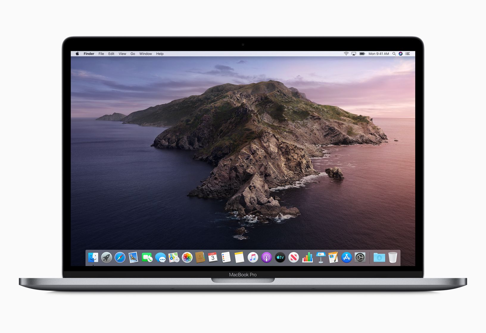
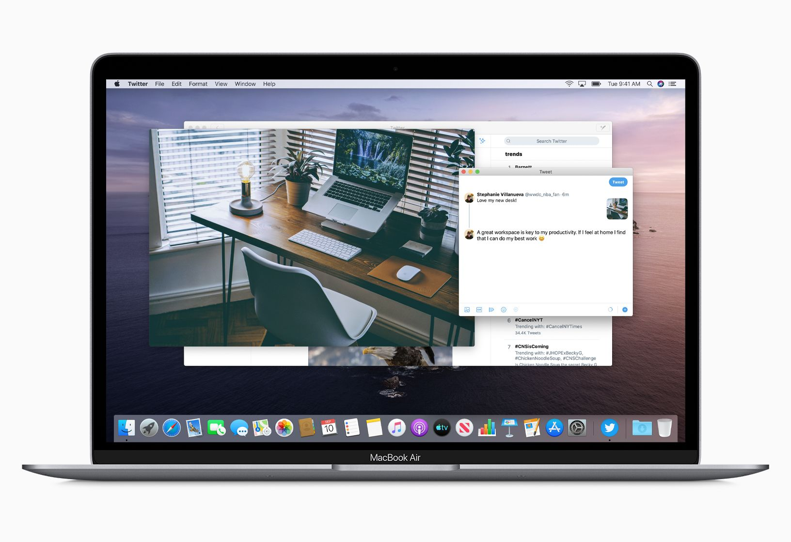

Da poco è uscito la nuova versione del sistema operativo di Apple. Questa versione segna un passaggio molto importante, l'abbandono del supporto al 32bit. Non dovrebbe essere un problema per molti ma chi ha magari un software vecchio con il quale è abituato a lavorare dovrà aggiornarsi.

### Addio iTunes
Il nuovo sistema operativo da l'addio anche a iTunes, macOS Catalina ha applicazioni separate per musica, TV e podcast.

### Sidecar
Sidecar è in realtà un'applicazione già esistente che è stata integrata a livello di sistema operativo e consente di ampliare la dimensione dello schermo usando un iPad. L'integrazione trae anche benefici dalla Apple pencil, si potrà in pratica usare l'iPad come una tavoletta grafica.

### Apple Arcade
Catalina avrà il supporto a Apple Arcade, il servizio in abbonamento che consente l'accesso a circa un centinaio di giochi sui dispositivi Apple dall'iPhone alla Apple TV.

### Tempo di utilizzo
Così come per l'iPhone sarà possibile analizzare quanto tempo ogni utente passi davanti al mac.

### Mac Catalyst
Sono delle API per sviluppare applicazioni per iPhone e iPad e portarle facilmente anche su Mac OSX.

Nell'immagine l'app di [Twitter](https://twitter.com/).

### Una nota sulla sicurezza che mi ha colpito
Software più sicuro. macOS Catalina viene eseguito in un volume dedicato di sola lettura: è separato da tutti gli altri dati sul Mac e nulla può sovrascrivere per sbaglio i file di sistema. In più, Gatekeeper ti garantisce che le app che installi sono state controllate per escludere problemi di sicurezza già noti, così il software che usi non è mai una minaccia. Mi ha ricordato tantissimo quando su Windows XP entravo nella cartella System32 e venivo avvisato che eventuali modifiche ai file avrebbero potuto compromettere il sistema.

### Approva con Apple Watch
Premi due volte il tasto laterale del tuo Apple Watch per autenticarti sul Mac. Puoi anche sbloccare le note protette, approvare l'installazione di app, e vedere le tue password nelle preferenze di Safari, sempre senza digitare nulla.

### Accessibilità
Grazie a Controllo vocale, chi non usa i sistemi di input tradizionali può controllare il Mac usando solo la voce. E nuovi strumenti dedicati a chi ha limitazioni visive consentono di zoomare su un paragrafo di testo o sull'intera schermata.

### Raccomandazioni
Catalina è uscito da poco e quindi sconsiglio l'aggiornamento a tutti quelli che lavorano con il proprio mac. Adobe ha già dichiarato che ci sono dei problemi di instabilità di alcune applicazioni, credo sia meglio aspettare sempre prima qualche settimana.

Per ulteriori informazioni su Catalina vi rimando al [sito ufficiale](https://www.apple.com/it/macos/catalina/)
