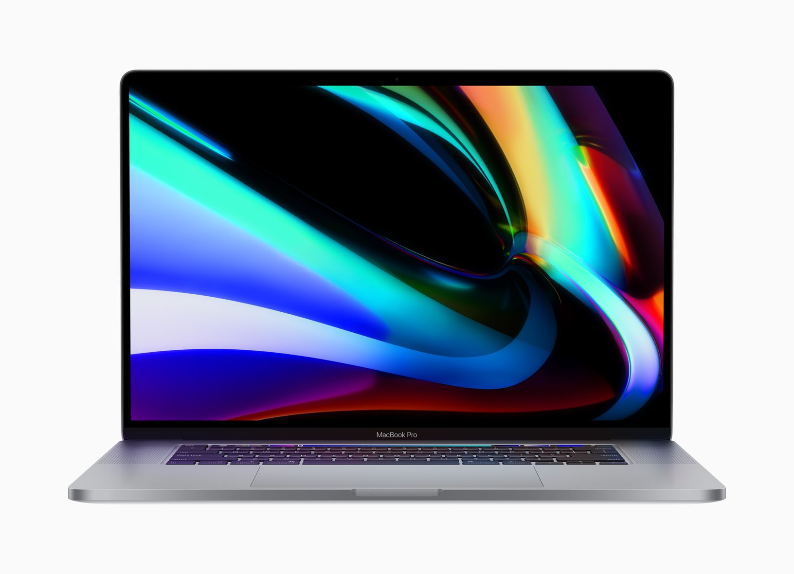
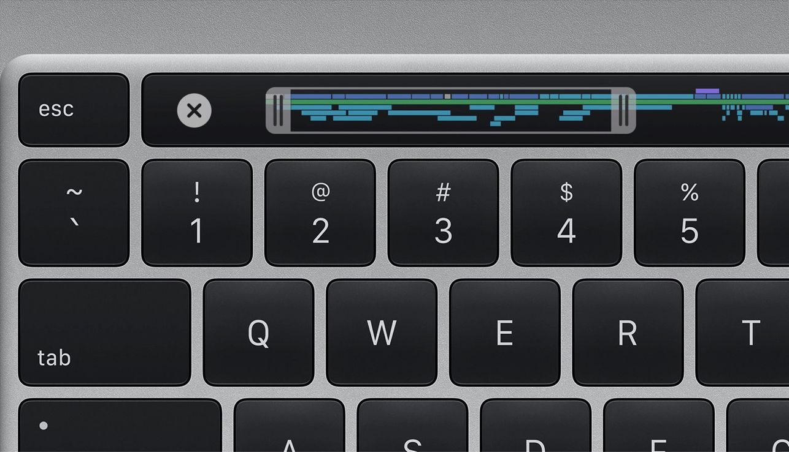

Apple ha presentato il suo nuovo portatile, il MacBook Pro 16", prenderà il posto del 15". Non è definibile un cambio di stile perché esteticamente è molto simile al modello da un pollice in meno ma dentro è stato rimodernato con hardware all'avanguardia, fuori si nota uno schermo leggermente più grande e con risoluzione maggiore ed una nuova tastiera riprogettata per evitare i problemi avuti con i modelli precedenti.

### Display

Il nuovo monitor ha una luminosità di 500 nit, e supporta lo spazio colore P3. La sua dimensione come è di 16 pollici ed ha una risoluzione di 3072x1920 pixel con una densità di 226 ppi

### Tastiera

La tastiera è stata riprogettata per evitare i problemi avuti con i precedenti modelli. Ora in particolare è stato anche aggiunto il tasto fisico di escape ( in alto a sinistra ) e per le frecce direzionali si è passati allo standard layout a T rovesciata.

### SSD

Finalmente il disco parte da una dimensione di 512GB, sufficiente per lavorare e può arrivare a ben 8TB. Il costo nel caso di questa configurazione è stratosferico ma al mondo non esiste alcun portatile con 8TB di disco, ed effettivamente ci sono anche pochi professionisti che ne hanno bisogno.

### RAM

Poche novità, si parte dagli ottimi 16GB che il sistema operativo gestisce molto bene fino ad arrivare a 64GB. Solita nota dolente ( ma ormai ci siamo abituati ) è saldata alla scheda madre quindi una volta comprato un macBook Pro non sarà possibile aumentarne la RAM.

### Scheda video

Come schede video Apple continua la sua partnership con AMD montando la Radeon Pro 5300M con 4GB di memoria GDDR6 e la Radeon Pro 5500M con 4 o 8GB di memoria GDDR6. Con queste schede è possibile avere fino a due monitor esterni con risoluzione 6016×3384 a 60Hz e oltre un miliardo di colori, oppure fino a quattro monitor esterni con risoluzione 4096×2304 a 60Hz e oltre un miliardo di colori.

### Audio

Anche lato audio ci sono diverse novità:
Come il sistema a sei altoparlanti hi‑fi con woofer force-cancelling, il supporto alla riproduzione Dolby Atmos e tre microfoni in array, di qualità professionale e con rapporto segnale/rumore elevato e beamforming direzionale.

Per quanto riguarda i processori sono gli intel core i7 e i9 top di gamma della nona generazione.
È stato migliorato il sistema di raffreddamento. Apple dichiara che questo macBook pro è fino all'80% più veloce del modello precedente.
I prezzi per l'Italia partono da 2799€ iva inclusa e arrivano a poco più di 7000€, le componenti incidono maggiormente sul prezzo finale sono il disco SSD e la RAM.

Per ulteriori informazioni ti lascio questo video di Andrea Galeazzi:

<iframe width="700" height="315" src="https://www.youtube.com/embed/98x-pYcCAlk" frameborder="0" allow="accelerometer; autoplay; encrypted-media; gyroscope; picture-in-picture" allowfullscreen></iframe>
