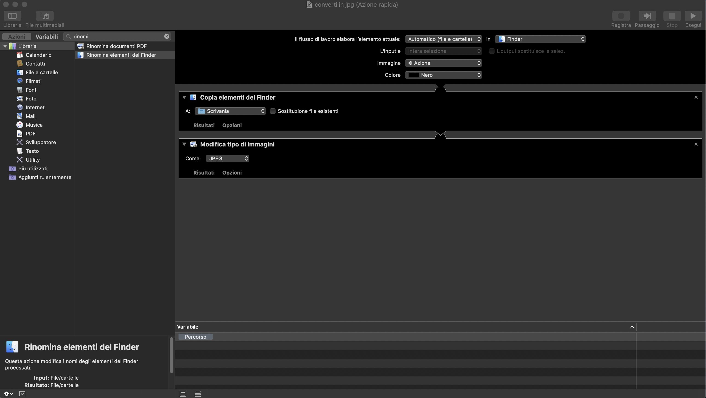
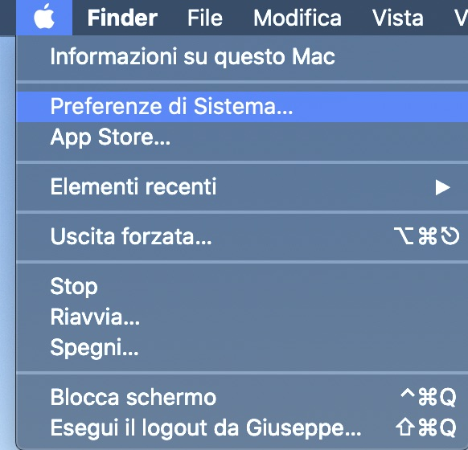

Ci sono vari modi per importare le tue foto dal tuo iphone al Mac o al PC ma in molti di questi casi il formato delle immagini risulta essere HEIC. In questa guida ti mostro come convertire ogni tipo di immagine in jpg da Mac.

Heic è un acronimo e sta per **High-Efficiency Image Format** un formato compresso creato da Apple che garantisce un rapporto tra compressione e perdita di informazioni migliore di jpg.

Per info, [la pagina di wikipedia sull'HEIC](https://it.wikipedia.org/wiki/High_Efficiency_Image_File_Format).

JPG è comunque quello più usato e molti siti richiedono questo formato.
Ho trovato una guida molto interessante su come convertire in modo veloce e gratuito i file da heic a jpg gratis da Mac.

Questo metodo usa l'applicazione Automator, presente di default su ogni Mac.

1. Premiamo prima il tasto mela e lo spazio contemporaneamente, apparirà Spotlight, all'interno di Spotlight scriviamo Automator.

2. Andiamo su "nuovo documento" in basso a sinistra

3. Tra le opzioni selezioniamo azione rapida

4. Inseriamo due comandi, prima **copia elementi del finder** selezionando come destinazione la scrivania e aggiungiamo poi **Modifica tipo di immagini** selezionando come "Jpeg"

                    
5. Salviamo con il nome "converti in jpg" o come più vi piace

Fatto, per testare questa nuova funzionalità selezioniamo una qualsiasi immagine e clicchiamoci sopra con il tasto destro o con control + tasto sinistro

Nel menù a tendina apparirà in basso la voce converti in jpg.

### Creare un abbreviazione da tastiera

Se vogliamo essere ancora più veloci possiamo creare un'abbreviazione da tastiera (shortcut) per convertire le nostre immagini in jpg.

1. cliccando sulla mela in alto a sinistra andiamo su preferenze di sistema.

2. Andiamo su tastiera e poi abbreviazioni
3. dall'elenco selezioniamo converti in jpg dall'elenco servizi ed aggiungiamo lo shortcut

Tutto questo funziona su Mac ma su windows o altri sistemi ci sono vari software dedicati oppure siti online come [questo](https://convertio.co/it/heic-jpg/).
