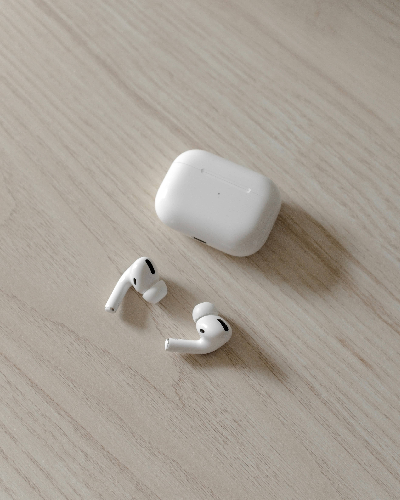

*Photo by Isaac Smith on Unsplash*

Uscite ormai da diversi mesi le auricolari di Apple hanno fatto parlare molto di loro per via del prezzo molto alto rispetto le competitors e del design. In questo articolo ti descrivo brevemente perché ho deciso di acquistarle e come mi ci sto trovando ormai da diversi mesi.

### Qualità audio
La qualità audio è buona, non stupisce ma comunque è più che sufficiente visto le dimensioni degli auricolari. Non hanno bassi particolarmente forti ma questo è dovuto al tipo di auricolare. I medi sono secondo me buono così come gli alti.

*Photo by Andres Jasso on Unsplash*

### Durata batteria
La durata dichiarata della batteria è di circa 4 ore, però l'astuccio delle cuffie funge da batteria. Quindi se qualcuno usa per più di 4 ore di fila le auricolari potrebbe avere dei problemi, altrimenti no.

### Ergonomia
L'ergonomia per me è ottima, entrano con facilità e non cadono. Le uso sia in palestra che quando corro e non mi hanno mai dato problemi ne fastidi.

### Uso durante sport
Come scritto prima le uso mentre corro e mentre sono in palestra e non cadono mai ne tantomeno si spostano. Questo è un giudizio personale quindi bisognerebbe vedere se si comportano allo stesso modo con persone differenti.

### Il vero bonus, il software
La marcia in più di queste cuffie è però il software che permette l'accoppiamento rapido con ogni dispositivo Apple compatibile.

### Active Noise Cancelling (ANC)
La riduzione del rumore è ottima, secondo molte recensioni seconda solo alle Sony [WH-1000X M3](https://amzn.to/2EIx8ub) e [WH-1000X M4](https://amzn.to/2YKbHjr) che sono però molto più grandi. Ci sono stati dalla loro uscita diversi aggiornamenti firmware per migliorare la qualità della riduzione rumore. Interessante oltre alla possibilità di ridurre i rumori esterni la modalità trasparenza che al contrario li amplifica.

### Audio spaziale
L'audio spaziale sarà una delle novità della versione 14 del sistema operativo per iPhone e permetterà di immergersi in tre dimensioni nell'audio, in pratica spostando l'iphone rispetto la posizione delle cuffie sarà come spostarsi all'interno della scena.

### Pairing
Il pairing con dispositivi Apple è molto veloce. In particolare poi è possibile switchare da un device all'altro molto velocemente senza dover fare come per tutte le altre cuffie bluetooth un nuovo accoppiamento. Se le cuffie sono vicine ad un mac le si vedranno come opzione di uscita e entrata audio automaticamente in pochi secondi.

### Conclusione
In conclusione credo che queste siano delle auricolari eccezionali per chi possiede prodotti Apple, in caso contrario molti dei loro pregi mancano e non so se varrebbe ancora la pena acquistarle. Ti lascio il link ad amazon per acquistarle [qui](https://amzn.to/2QzkwrV).
