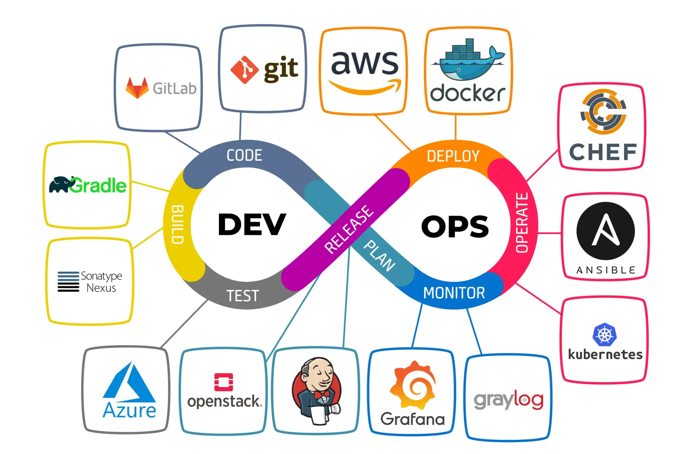

Quando si parla di DevOps non ci si riferisce a una posizione lavorativa bensì a una strategia per aumentare l’efficienza dello sviluppo di un progetto software unendo le fasi di sviluppo (DEV) e operation (OPS) creando così un ciclo di Continuous Integration e Continuous Delivery. Obbiettivo della pratica DevOps è aumentare la velocità, la qualità, la stabilità nello sviluppo software.

### Dev
Per dev si intendono gli sviluppatori (Software Developer) la cui responsabilità è di scrivere il codice che implementa la logica business. I Dev hanno principalmente a che fare con il codice.

### Ops
Detti anche IT Operations sono invece i responsabili per la gestione dei datacenter, l’installazione e il setup delle macchine, la gestione della rete, il monitoring e l’alerting.

### SRE
Reliability Engineer, è una figura professionale creata all’interno di Google nel 2003. Google aveva servizi su larga scala (come lo stesso motore di ricerca) complessi e che richiedevano un’elevata stabilità. Gli sviluppatori inoltre erano più orientati allo sviluppo di nuove funzionalità che alla manutenzione del software preesistente. Fu così che nacque la figura del SRE che aveva come compito principale mantenere la stabilità dei servizi Google. Gli SRE sono in pratica un’evoluzione degli OPS ma a differenza di loro non hanno più a che fare con l’hardware. Creano strumenti appositi per assicurarsi della stabilità del sistema e tipicamente hanno un ottima conoscenza nella programmazione software che usano per creare strumenti che li aiutino nel loro lavoro.

### DevOps
Come detto prima DevOps è una metodologia.

In DevOps se si può automatizzare qualcosa bisogna farlo!
I benefici dell’automazione sono che il team si può concentrare sul prodotto in se, i risultati sono ripetibili, predicibili e in caso di problemi si può arrivare alla loro soluzione più velocemente. Per questo CI/CD è una parte fondamentale del DevOps.

Il DevOps Engineer analizza il problema dall’alto, gestendo:

- i workflows;
- settaggio e configurazione delle infrastrutture;
- permessi di sistema;
- i bisogni dei vari team.

### DevSecOps (DevOps + Security)
DevSecOps è un approccio dove si inserisce la sicurezza all’interno del ciclo di vita dello sviluppo, a ogni suo livello, inserendo appositi controlli di sicurezza nelle pipeline CI/CD. Una parte fondamentale, ad esempio, è l’analisi statica del codice fatta all’interno della pipeline di CI prima della fase di build. In questo modo è possibile individuare alcuni bug o cattivo uso della memoria o ancora individuare possibili falle che hackers potrebbero utilizzare.

### Approccio CALMS
CALMS sta per Culture, Automation, Lean, Measurement, Sharing. È un framework trattato nel The DevOps Handbook. È un acronimo delle caratteristiche per adottare a pieno il modello DevOps. Cultura - Rimuovere i compartimenti stagni e condividi le responsibilità:

- Automazione - Riduci il tempo speso in attività manuali;
- Lean - Semplifica i processi per velocizzare i tempi;
- Misura - Estrai e analizza i dati e trova punti dove ottimizzare;
- Condivisione - collaborazione tra team.

### Build Manager
Ci sono poi figure che agevolano la metodologia DevOps come il Build Manager che si occupa di mantenere le automazioni che rendono possibile la Continuous Integration (CI).

### Release Manager
Il Release Manager dirige le build che devono essere rilasciate. Si occupa di comunicare quello che è incluso in un determinato rilascio.

### GitOps
GitOps rappresenta invece un approccio al DevOps basato su Git, il software di version tracking più utilizzato. Molte pipeline di CI/CD usano GIT e sono scatenate da eventi di questo software. Tramite Git è più facile gestire i rollback in caso di errori nel deploy. È possibile inserirvi anche l’infrastructure as code (IaC), come ad esempio terraform, versionando quindi anche l’infrastruttura e non solo il codice.