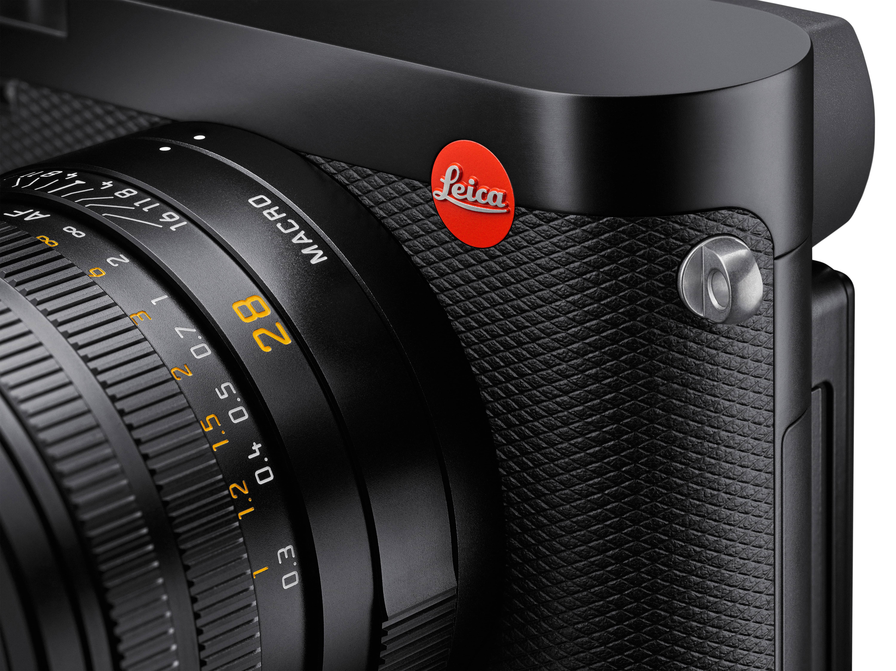
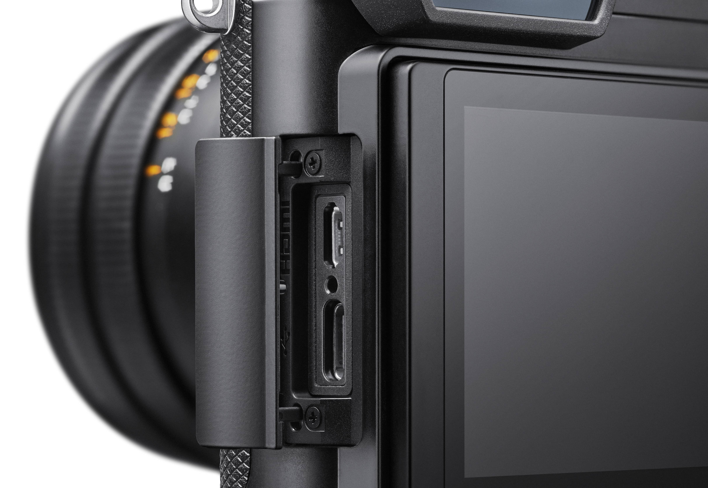
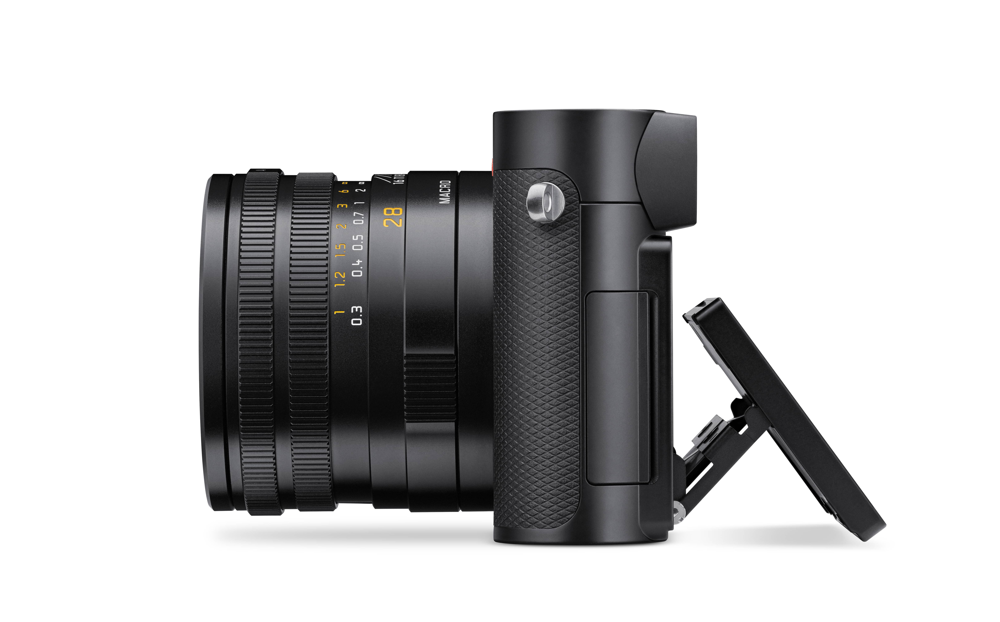
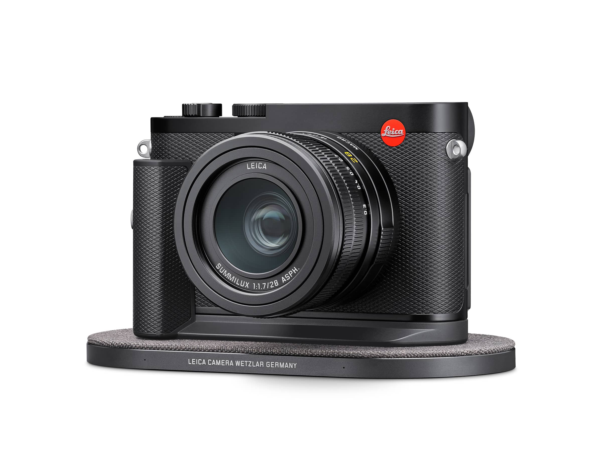

Leica ha presentato oggi la nuova Q3, una fotocamera compatta full frame con sensore da 60MP.

### Estetica
Da punto di vista estetico cambia poco, mantiene le stesse dimensioni del modello precedente. Sul retro però si notano meno pulsanti e un display touch tilt screen. Sul lato c’è anche una porta USB di tipo C e una hdmi.

### Specifiche tecniche
Mentre la lente è rimasta la stessa il processore Maestro, cuore della camera, si aggiorna e arriva alla versione 4.
Il sensore passa da 50 a 60 megapixel.
Tramite la porta USB-C è possibile fare tethering con le App Lightroom e Capture One.

C’è inoltre la possibilità di registrare video con risoluzione fino a 8K ma con l’audio dei microfoni incorporati nella macchina.

### Accessori
E’ inoltre stato presentato un accessorio per caricare in maniera wireless la camera.

### Prezzo e Disponibilità

La Leica Q3 sarà disponibile da giugno 2023 al prezzo di 5.995€.
