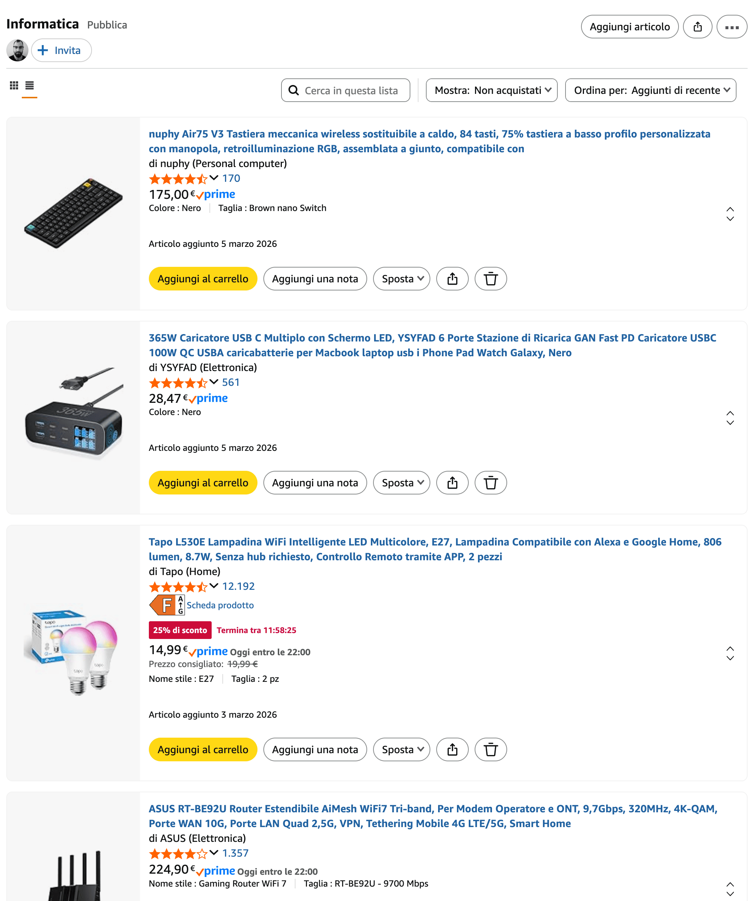
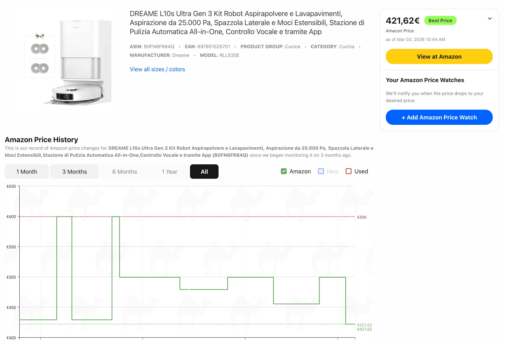

Dal 10 al 16 marzo 2026 Amazon lancia le sue Offerte di Primavera, una settimana di sconti su migliaia di prodotti. Le offerte in evidenza sulle prime pagine non sempre corrispondono ai prezzi più bassi di sempre, e il rischio di comprare d'impulso qualcosa di cui non si ha reale bisogno è sempre dietro l'angolo.
In questa guida ti spiego come prepararti con anticipo, monitorare i prezzi e fare acquisti davvero convenienti, senza farti trascinare dall'hype del momento.

## Inizia dalla Lista dei Desideri: il tuo strumento più potente

La Lista dei Desideri di Amazon è uno strumento strategico per monitorare l'andamento dei prezzi degli ogetti che ci interessano efare acquisti consapevoli.

Aggiungi i prodotti prima che inizino le offerte, così puoi confrontare il prezzo promozionale con quello originale in modo chiaro.
Crea liste tematiche separate: una per l'elettronica, una per la casa, una per la cura personale. Questo ti aiuta a non perdere di vista le priorità.
Aggiungi più varianti dello stesso prodotto: ad esempio, se stai cercando un robot aspirapolvere, metti nella lista i modelli di 3-4 brand diversi. Quando arrivano le offerte, hai già tutto pronto per confrontare.

Inizia a costruire le tue liste almeno 2-3 settimane prima dell'inizio delle offerte. In questo modo avrai una fotografia chiara del prezzo "normale" di ogni prodotto, e riconoscerai subito se lo sconto è reale o è solo marketing.

## Monitora i Prezzi con CamelCamelCamel e altri Tool

Uno degli errori più comuni durante i saldi Amazon è credere che il prezzo scontato mostrato sia davvero il più basso di sempre. In realtà, Amazon modifica i prezzi più volte al giorno, e spesso il prezzo di partenza su cui viene calcolato lo sconto è molto vecchio.
CamelCamelCamel è il tracker di prezzi Amazon più utilizzato al mondo.

Vai su camelcamelcamel.com e incolla il link del prodotto Amazon che vuoi monitorare.
Visualizzi il grafico storico del prezzo: vedrai immediatamente se il prezzo attuale è davvero vantaggioso o se il prodotto è già stato più economico in passato.
Installa l'estensione browser (disponibile per Chrome e Firefox) per vedere il grafico storico direttamente sulla pagina Amazon, senza dover copiare i link.

### Altri tool utili

- Keepa.com — simile a CamelCamelCamel, con grafici ancora più dettagliati e un'estensione browser molto completa. Mostra anche le variazioni di disponibilità e le offerte dei venditori terzi.
- Google Shopping — utile per confrontare il prezzo Amazon con quello di altri negozi online, assicurandoti che Amazon offra davvero il prezzo più competitivo sul mercato.

## La Strategia degli Acquisti in Blocco: risparmia sul lungo periodo

C'è una categoria di prodotti per cui le Offerte di Primavera rappresentano un'opportunità d'oro: i beni di consumo quotidiano senza scadenza ravvicinata.
Il principio è semplice: se un prodotto che usi ogni giorno va in sconto del 30-40%, acquistarne più mesi di scorta ti fa risparmiare una cifra significativa nel corso dell'anno, senza alcun rischio di spreco.
Prodotti ideali per gli acquisti in blocco sono:

Igiene personale: dentifricio, deodorante, shampoo, balsamo, bagnoschiuma, sapone liquido, rasoi monouso, filo interdentale.
Carta e pulizia della casa: carta igienica, carta da cucina (rotoloni), fazzoletti, sacchi per l'immondizia, pellicola per alimenti, carta forno.
Detersivi e prodotti per la pulizia: detersivo per lavatrice, lavastoviglie, multiuso per superfici, disinfettanti, ammorbidente.
Alimenti a lunga conservazione: caffè in capsule o in grani, pasta, olio d'oliva, tonno in scatola, legumi in barattolo, spezie.
Integratori e vitamine: prodotti che usi regolarmente e che hanno una lunga data di scadenza.

## Come Valutare se un'Offerta è Davvero Conveniente

Non tutte le offerte che Amazon mette in evidenza sono uguali. Ecco una checklist rapida da applicare prima di ogni acquisto:

Controlla la storia del prezzo su CamelCamelCamel: il prezzo attuale è davvero il minimo storico, o ci sono stati periodi in cui era anche più basso?
Verifica il venditore: gli sconti migliori sono sempre quelli su prodotti venduti e spediti direttamente da Amazon. Diffida di venditori terzi poco conosciuti, anche se il prezzo è allettante, diffida di più quando il prezzo è troppo allettante.
Leggi le recensioni recenti: a volte i prodotti in forte sconto sono versioni precedenti o modelli che stanno per essere sostituiti. Controlla che le recensioni siano aggiornate.
Calcola il costo per unità: soprattutto per i prodotti in multipack, calcola quanto costa ogni singola unità e confrontalo con il formato che compri di solito.
Chiediti: lo comprerei anche senza lo sconto? Se la risposta è no, probabilmente non ne hai davvero bisogno.

## Categorie da Tenere d'Occhio dal 10 al 16 Marzo

Le Offerte di Primavera Amazon coprono tutte le categorie, ma alcune storicamente registrano gli sconti più interessanti:

Piccoli elettrodomestici — robot aspirapolvere, robot da cucina, aspiratori verticali. Aggiungi più modelli in lista e confronta durante l'evento.
Dispositivi Amazon — Echo, Kindle, Fire TV Stick e Ring raggiungono spesso i minimi storici durante gli eventi ufficiali Amazon.
Cura della persona e prodotti per la casa — come descritto sopra, perfetti per acquisti in blocco.
Abbigliamento e scarpe — spesso in offerta lampo con durata limitata di poche ore, quindi conviene monitorare più volte al giorno.
Sport e outdoor — con la primavera alle porte, le attrezzature per sport all'aria aperta, bici e campeggio sono spesso in promozione.

## Conclusione: Prepararsi è il Segreto del Risparmio Vero

Le Offerte di Primavera Amazon sono un'opportunità reale, ma solo per chi arriva preparato. La differenza tra chi risparmia davvero e chi spende d'impulso si misura nelle settimane precedenti all'evento: costruire le liste dei desideri, monitorare i prezzi, identificare i prodotti di consumo quotidiano da acquistare in blocco.

Se sei arrivato fino a qui e hai trovato l'articolo interessante ti invito ad andare su amazon tramite l'immagine appena sotto, così da supportare il blog senza spendere un centesimo in più, e a condividere questo articolo con amici e parenti che potrebbero trarre beneficio da questi consigli per fare acquisti intelligenti durante le Offerte di Primavera Amazon.

