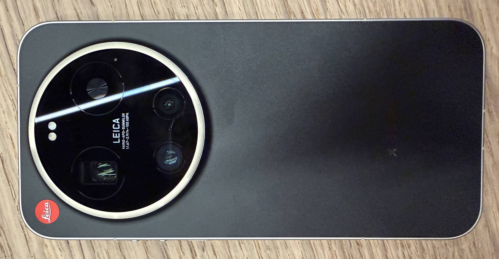
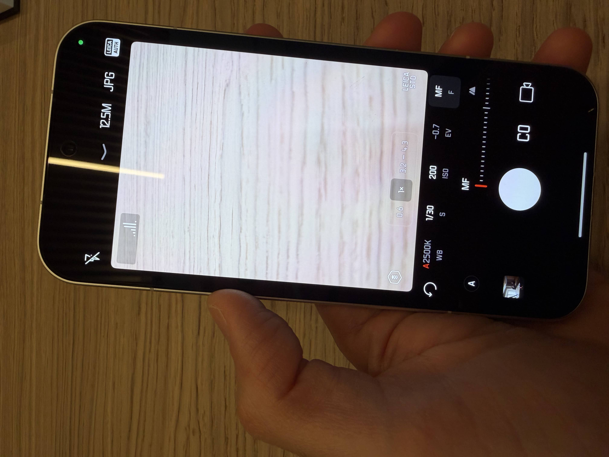

# Xiaomi Leica Leitzphone (2026): La Fotografia Analogica nel Digitale

Il Leica Leitzphone (2026), conosciuto anche come "Leitz Phone 4" o "Leitzphone powered by Xiaomi", rappresenta l'apice della collaborazione tra il colosso cinese e la storica casa fotografica tedesca. Ho avuto la possibilità di provarlo nello store di Leica a Milano.

## 📸 1. Caratteristiche Fondamentali del Leitzphone (2026)

### Il "Leica Camera Ring"
La caratteristica hardware più distintiva. È una ghiera fisica/capacitiva posizionata attorno al modulo fotografico posteriore che permette di controllare manualmente zoom, messa a fuoco, ISO o esposizione, simulando il feeling di un obiettivo Leica M.

### Sensore Principale da 1"
Utilizza il nuovo sensore Light Fusion 1050L con tecnologia LOFIC, che garantisce una gamma dinamica superiore e gestisce i forti contrasti (luci/ombre) meglio di qualsiasi altro smartphone precedente.

### Teleobiettivo da 200 MP
Un sistema periscopico con zoom ottico continuo (75-100mm) che permette di mantenere una qualità estrema senza perdite digitali in quel range di focali.

### Display HyperRGB OLED
Display da 6.9 pollici con una luminosità di picco di 3.500 nit, ottimizzato per una riproduzione del colore fedele agli standard Leica.

### Hardware di Punta
Cuore pulsante Snapdragon 8 Elite Gen 5, 16 GB di RAM LPDDR5X e 1 TB di memoria.

## ⚖️ 2. Differenze con lo Xiaomi 17 Ultra

Sebbene condividano gran parte della "spina dorsale" tecnica, le differenze risiedono nel design, nel software e nella filosofia d'uso.

| Caratteristica | Xiaomi 17 Ultra | Leica Leitzphone (2026) |
|---|---|---|
| **Design Posteriore** | Ecopelle o ceramica con logo orizzontale | Fibra di vetro nera con finitura zigrinata e bollino rosso Leica |
| **Controlli Fisici** | Standard (Touch + tasti volume) | Leica Camera Ring (ghiera rotante sul modulo camera) |
| **Software UI** | HyperOS 3 standard | Interfaccia Custom Leica (font, icone e widget ispirati alle fotocamere M) |
| **Modalità Foto** | Leica Authentic/Vibrant + filtri standard | Leica Essential Mode e simulazione pellicole storiche (Monopan, M9, M3) |
| **Batteria** | 6.000 mAh | 6.330 mAh (alcune varianti riportano una gestione energetica più spinta per le sessioni foto) |
| **Posizionamento** | Il top di gamma "per tutti" | Prodotto di nicchia, per puristi e collezionisti |

## 💬 3. Cosa dicono le Recensioni

**L'esperienza "Analogica":** DDay e HDblog sottolineano come la ghiera fisica cambi completamente il modo di scattare, rendendo l'esperienza meno "punta e scatta" e più ragionata.

**Qualità d'Immagine:** Su YouTube Tech reviews loda il sensore da 1 pollice per l'assenza di elaborazione AI invasiva. Le foto appaiono naturali, con una "pasta" cromatica che ricorda le vere macchine Leica.

**Il Teleobiettivo:** Le recensioni concordano sul fatto che lo zoom da 200 MP sia "impressionante" per dettaglio, specialmente nei ritratti a 75mm e 90mm.

**Software Minimalista:** Molti utenti su Reddit apprezzano il "Leica Essential Mode", che pulisce l'interfaccia da distrazioni e si concentra solo sui parametri fotografici puri.

**Il Prezzo e l'Esclusività:** Viene definito un "oggetto del desiderio". Il costo è sensibilmente più alto dello Xiaomi 17 Ultra (circa 500€ in più), giustificato dal design premium in lega anodizzata al nichel e dal prestigio del marchio.

## 📸 4. Comparto Fotografico Posteriore

Il Leica Leitzphone (2026), co-sviluppato con Xiaomi, monta un sistema a tripla fotocamera posteriore che si distingue per l'uso di sensori ad altissima risoluzione e ottiche di precisione Vario-Apo-Summilux.

### Sensore Principale: 50 MP
- **Tipo:** Light Fusion 1050L da 1 pollice
- **Caratteristiche:** Tecnologia LOFIC HDR per una gamma dinamica estrema, apertura f/1.67, focale equivalente 23mm e stabilizzazione ottica OIS

### Teleobiettivo Periscopico: 200 MP
- **Tipo:** Sensore Samsung ISOCELL HP3 (adattato) da 1/1.4"
- **Caratteristiche:** Zoom ottico meccanico continuo tra 75mm e 100mm (f 2.39 - 2.96), con capacità di spingersi fino a un equivalente di 400mm tramite zoom "in-sensor". Dotato di OIS

### Ultra-Grandangolare: 50 MP
- **Tipo:** Sensore Samsung JN5 da 1/2.75"
- **Caratteristiche:** Focale 14mm, apertura $f/2.2, campo visivo (FOV) di 115° e supporto per la fotografia macro a 5 cm

## 🤳 Fotocamera Anteriore

**Sensore Selfie: 50 MP**
- **Tipo:** Sensore OmniVision OV50M da 1/2.87"
- **Caratteristiche:** Apertura $f/2.2$ e supporto per l'autofocus

## Conclusione

Il Leica Leitzphone (2026) rappresenta un punto di svolta nella fotografia mobile, unendo l'eredità artigianale di Leica con l'innovazione tecnologica di Xiaomi. Con il suo Leica Camera Ring, sensori avanzati e interfaccia minimalista, offre un'esperienza fotografica unica che va oltre il semplice "punta e scatta". Se sei un appassionato di fotografia che cerca un dispositivo premium e distintivo, questo smartphone potrebbe essere il compagno ideale per catturare momenti indimenticabili.

Per ulteriori informazioni, visita i siti ufficiali:
- [Xiaomi: Leica Leitzphone powered by Xiaomi](https://www.mi.com/it/product/leica-leitzphone-powered-by-xiaomi/)
- [Leica Camera: Leitzphone powered by Xiaomi](https://leica-camera.com/it-IT/mobile/leitzphone-powered-by-xiaomi)

