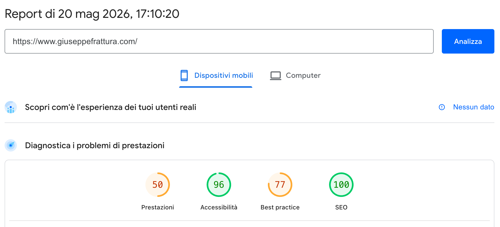
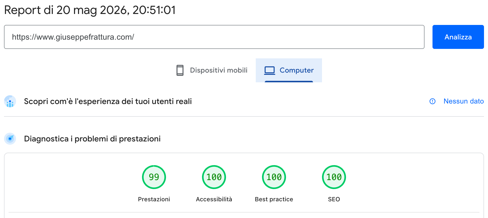
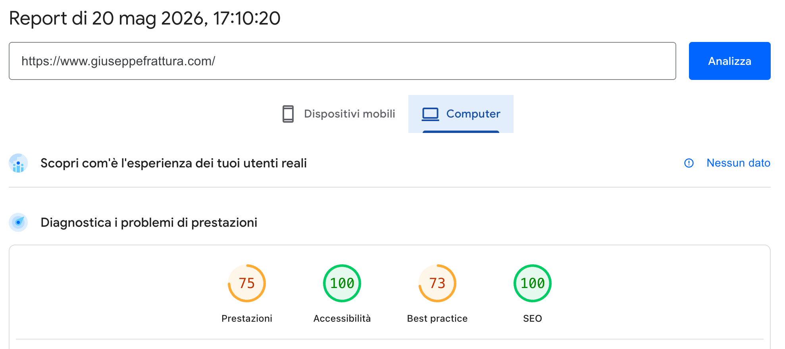
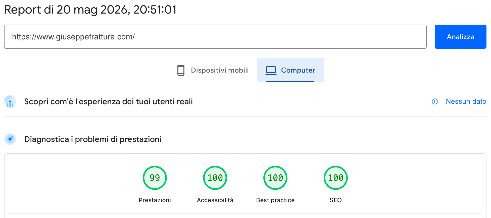

Introduzione
------------

Ottimizzare le performance di un sito web non è solo una questione di vanity metrics o di avere un cerchio verde su Google Lighthouse. Si tratta di esperienza utente reale, di tassi di abbandono che crollano e di un miglioramento diretto del posizionamento SEO.

Fino a ieri, questo blog si trovava in una situazione comune a molti siti moderni: pur essendo sviluppato in Astro (noto per la sua filosofia di "zero JavaScript di default"), presentava una serie di colli di bottiglia nel caricamento che penalizzavano il punteggio di performance mobile su Lighthouse, fermo a un deludente **61/100**.

In questo articolo vi racconto, passo dopo passo, come ho fatto pair programming con **Gemini 3.5** direttamente all'interno del mio workspace per analizzare i problemi, applicare modifiche architetturali mirate e raggiungere un punteggio di **97/100** su mobile.

Prima e Dopo: I Risultati
-------------------------

Prima di entrare nei dettagli tecnici, guardiamo i dati concreti misurati tramite Lighthouse su una simulazione di rete mobile:

| Metrica | Prima dell'Ottimizzazione | Dopo l'Ottimizzazione | Miglioramento |
| :--- | :---: | :---: | :---: |
| **Punteggio Performance** | **61 / 100** | **97 / 100** | **+36 punti** (Eccezionale! 🎉) |
| **First Contentful Paint (FCP)** | `6.20s` | **`1.81s`** | **-70.8%** di tempo di attesa |
| **Largest Contentful Paint (LCP)** | `6.74s` | **`2.33s`** | **-65.4%** di caricamento dell'elemento principale |
| **Speed Index (SI)** | `6.20s` | **`1.81s`** | **-70.8%** per visualizzare la pagina |
| **Total Blocking Time (TBT)** | `0 ms` | **`0 ms`** | Mantenuto a zero (ottima reattività) |
| **Cumulative Layout Shift (CLS)** | `0` | **`0.014`** | Praticamente nullo (layout perfettamente stabile) |

### 📱 Risultati su Dispositivi Mobili

Ecco il confronto visivo di Lighthouse su mobile, dove l'impatto delle ottimizzazioni sul tempo di caricamento è stato più evidente:


*Punteggio di performance iniziale su mobile (61/100) con pesanti colli di bottiglia.*


*Punteggio di performance dopo le ottimizzazioni (97/100) su mobile.*

### 💻 Risultati su Desktop

Anche su desktop abbiamo registrato un balzo in avanti eccellente, perfezionando ogni metrica di caricamento:


*Punteggio di performance iniziale su desktop.*


*Punteggio di performance finale su desktop.*

Un balzo in avanti straordinario che ha ridotto il tempo di caricamento percepito di oltre **4 secondi e mezzo**. Ma come ci siamo riusciti? Ecco le quattro ottimizzazioni chiave suggerite e implementate insieme a Gemini 3.5.

---

Le 4 Ottimizzazioni Chiave
--------------------------

### 1. Eliminazione totale del runtime Svelte (Zero-JS Navbar)

Il primo problema emerso dall'analisi delle richieste di rete era la presenza di file JavaScript legati a Svelte nella build finale. Perché avevamo del codice Svelte se il sito è statico? La colpa era del pulsante per cambiare il tema (chiaro/scuro):

```astro
<!-- Prima dell'ottimizzazione in Nav.astro -->
<ThemeToggleButton client:load />
```

Usare un componente Svelte caricato sul client obbligava Astro a includere il compilatore Svelte, l'hydrator e il codice JS del componente per tutti i visitatori, appesantendo la pagina iniziale.

**La soluzione di Gemini:** riscrivere il componente come file nativo di Astro (`.astro`) gestendo l'interattività tramite vanilla JavaScript inline a basso costo energetico.

Rimuovendo completamente Svelte dall'integrazione di Astro in `astro.config.mjs`, abbiamo eliminato il framework runtime dal client:
* **Risultato:** Zero byte di JavaScript del framework scaricati all'avvio del sito. La pagina è ora al 100% HTML e CSS statico nel caricamento iniziale.

### 2. Il "Facade Pattern" per i video incorporati di YouTube

Nella homepage era presente un video di YouTube incorporato tramite il classico tag `<iframe>`. I video di YouTube sono noti per essere devastanti dal punto di vista delle performance: non appena la pagina si carica, l'iframe scarica megabyte di script del player di Google, fogli di stile e asset video, bloccando la CPU del telefono dell'utente.

**La soluzione di Gemini:** creare un componente facade chiamato `YoutubeEmbed.astro`.

Invece di caricare subito l'iframe, il componente facade:
1. Genera staticamente l'URL dell'immagine di copertina (thumbnail) del video direttamente dai server di YouTube.
2. Renderizza una semplice immagine ottimizzata e un pulsante "Play" stilizzato in puro CSS.
3. Utilizza pochissime righe di JavaScript che, al click dell'utente sulla copertina, rimuovono l'immagine e iniettano dinamicamente il vero iframe di YouTube con autoplay attivo.

```astro
<!-- Il nuovo approccio in index.astro -->
<YoutubeEmbed videoId="6fFzVyV1FWk" title="YouTube video player" />
```

* **Risultato:** Il browser non scarica assolutamente nulla da YouTube fino a quando l'utente non decide attivamente di riprodurre il video. Risparmio netto all'avvio: diverse centinaia di richieste di rete e oltre 1.5MB di JavaScript non necessario.

### 3. Ottimizzazione delle immagini sopra la piega (LCP)

L'immagine del mio avatar in homepage era un semplice tag `` che puntava a una risorsa JPEG non ottimizzata. Questo faceva sì che l'elemento principale visibile all'utente (il Largest Contentful Paint) impiegasse quasi 7 secondi per essere scaricato e renderizzato a causa della priorità di rete standard e delle dimensioni non compresse del file.

**La soluzione di Gemini:** convertire l'immagine usando il componente ottimizzato nativo di Astro (`astro:assets`) e impostare i corretti suggerimenti per il browser.

```astro
<!-- Nuovo codice ottimizzato con Astro -->
<Image 
  src={avatarImg} 
  alt="Illustration of Giuseppe Frattura" 
  width={300} 
  height={300} 
  fetchpriority="high" 
  loading="eager" 
/>
```

Grazie a questa modifica:
* Astro compila automaticamente l'immagine originale in formati moderni ultra-compressi (come `.webp`).
* L'attributo `fetchpriority="high"` dice al browser che l'immagine è di fondamentale importanza, forzando il download prioritario.
* L'attributo `loading="eager"` disabilita il lazy-loading per questa specifica immagine, garantendo che venga renderizzata all'istante.

### 4. Risoluzione dei Layout Shift (CLS) impostando dimensioni esplicite

In pagine secondarie come `/links` e `/uauaua` (la mia sezione di soundboard divertenti), c'erano diverse immagini di pulsanti ed elementi grafici che non avevano larghezza e altezza dichiarate nel codice HTML. Questo causava dei fastidiosi scatti di layout (layout shifts) quando le immagini finivano di scaricarsi, spostando il testo circostante.

Abbiamo sistemato ogni singola immagine assegnando gli attributi `width` e `height` corretti. In questo modo, il browser riserva esattamente lo spazio necessario prima ancora che l'immagine sia scaricata, eliminando qualsiasi sfarfallio o scatto grafico per l'utente finale.

Conclusione: Il valore del Pair Programming con l'AI
----------------------------------------------------

Questo piccolo esperimento dimostra la vera potenza degli assistenti di programmazione moderni. L'AI non deve essere usata solo per generare righe di codice a ripetizione, rischiando di creare codebase disordinate. 

Il vero valore emerge quando si lavora in modo strategico:
1. **Analisi contestuale:** Gemini ha analizzato il repository per capire l'architettura (Astro, Svelte, Sentry).
2. **Diagnosi architetturale:** Ha individuato che il caricamento di Svelte per un singolo pulsante era un controsenso per un sito statico.
3. **Applicazione di design pattern collaudati:** Ha suggerito soluzioni intelligenti come il Facade Pattern per i video.

Il risultato è un sito web che si carica in un batter d'occhio, consuma meno dati per l'utente mobile ed è pronto a scalare sui motori di ricerca. E voi, quando è stata l'ultima volta che avete fatto un check-up completo alle performance del vostro sito?
